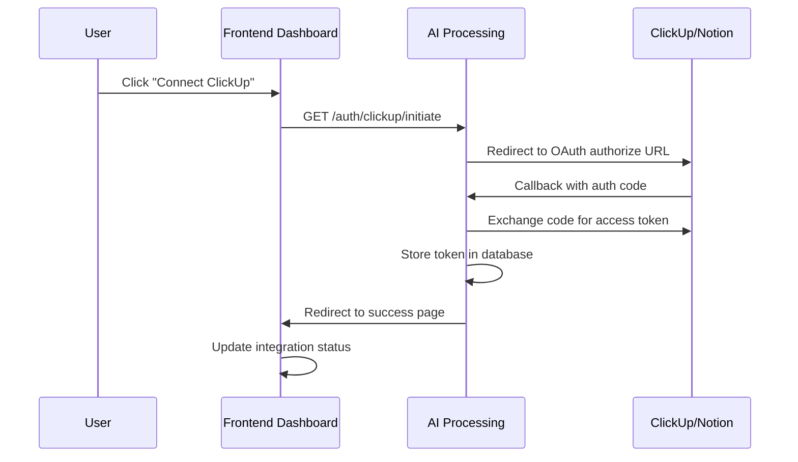

# 🔧 Integration as Callable Utility - Analysis & Implementation Plan

## Overview
This document analyzes the requirements and provides a comprehensive implementation plan for converting the integration service into a callable utility with OAuth authentication flow for ClickUp and Notion.

## 📊 Current State Analysis

### Frontend Dashboard State
**Location**: `scrumy/frontend_dashboard/app/integrations/page.js`
**Current Implementation**:
- Mock integration cards with hardcoded data
- Basic connect/disconnect buttons (no real OAuth)
- Static status management
- No real authentication flow

### Integration Service State  
**Location**: `scrumy/integration/app/integrations.py`
**Current Implementation**:
- Direct API integrations with environment variable tokens
- Mock mode fallbacks for development
- NotionIntegration, SlackIntegration, ClickUpIntegration classes
- No OAuth handling, assumes tokens are pre-configured

### AI Processing State
**Location**: `scrumy/ai_processing/app/integration_adapter.py`
**Current Implementation**:
- Mock integration adapter that simulates external calls
- Structured data models (ParticipantData, MeetingData, etc.)
- Ready to call external integration functions

## 🎯 Requirements Analysis

### 1. OAuth Flow Requirements


### 2. Task Creation Logic
```python
# Priority logic for task creation
def determine_task_provider(user_id: str, task_data: Dict) -> str:
    auth_status = get_user_auth_status(user_id)
    
    if auth_status.clickup and not auth_status.notion:
        return "clickup"
    elif auth_status.notion and not auth_status.clickup:
        return "notion"
    elif auth_status.clickup and auth_status.notion:
        # Smart routing logic needed
        return smart_route_task(task_data, auth_status)
    else:
        return "pending"  # No providers available
```

### 3. Integration Utility Architecture
```python
# New callable utility structure
from integration.callable_utility import IntegrationUtility

integration_util = IntegrationUtility()

# Usage in AI processing
result = await integration_util.create_task(
    user_id="user_123",
    task_data={"title": "Review sprint goals", "priority": "high"},
    routing_preference="smart"  # or "user_choice"
)
```

## 🛠️ Implementation Plan

### Phase 1: OAuth Infrastructure Setup

#### 1.1 Database Schema Extensions
**File**: `ai_processing/app/database_interface.py`
```sql
-- New tables needed
CREATE TABLE user_auth_tokens (
    id TEXT PRIMARY KEY,
    user_id TEXT NOT NULL,
    platform TEXT NOT NULL,  -- 'clickup', 'notion'
    access_token TEXT NOT NULL,
    refresh_token TEXT,
    token_type TEXT DEFAULT 'Bearer',
    expires_at TIMESTAMP,
    scope TEXT,
    created_at TIMESTAMP DEFAULT CURRENT_TIMESTAMP,
    updated_at TIMESTAMP DEFAULT CURRENT_TIMESTAMP,
    UNIQUE(user_id, platform)
);

CREATE TABLE pending_tasks (
    id TEXT PRIMARY KEY,
    user_id TEXT NOT NULL,
    task_data TEXT NOT NULL,  -- JSON
    created_at TIMESTAMP DEFAULT CURRENT_TIMESTAMP,
    status TEXT DEFAULT 'pending'  -- 'pending', 'created', 'failed'
);

CREATE TABLE integration_preferences (
    id TEXT PRIMARY KEY,
    user_id TEXT NOT NULL,
    clickup_workspace_id TEXT,
    notion_database_id TEXT,
    default_provider TEXT,  -- 'clickup', 'notion', 'smart'
    created_at TIMESTAMP DEFAULT CURRENT_TIMESTAMP,
    UNIQUE(user_id)
);
```

#### 1.2 OAuth Endpoints in AI Processing
**File**: `ai_processing/app/oauth_handler.py`
```python
from fastapi import APIRouter, HTTPException, Request
from fastapi.responses import RedirectResponse
import httpx
import os

router = APIRouter()

@router.get("/auth/{platform}/initiate")
async def initiate_oauth(platform: str, user_id: str):
    """Initiate OAuth flow for ClickUp or Notion"""
    if platform == "clickup":
        auth_url = f"https://api.clickup.com/api/v2/oauth/authorize"
        params = {
            "client_id": os.getenv("CLICKUP_CLIENT_ID"),
            "redirect_uri": f"{os.getenv('APP_BASE_URL')}/auth/clickup/callback",
            "state": user_id
        }
    elif platform == "notion":
        auth_url = f"https://api.notion.com/v1/oauth/authorize"
        params = {
            "client_id": os.getenv("NOTION_CLIENT_ID"),
            "redirect_uri": f"{os.getenv('APP_BASE_URL')}/auth/notion/callback",
            "response_type": "code",
            "owner": "user",
            "state": user_id
        }
    else:
        raise HTTPException(status_code=400, detail="Unsupported platform")
    
    # Build auth URL
    auth_url += "?" + "&".join([f"{k}={v}" for k, v in params.items()])
    return RedirectResponse(auth_url)

@router.get("/auth/{platform}/callback")
async def oauth_callback(platform: str, code: str, state: str):
    """Handle OAuth callback and exchange code for token"""
    user_id = state
    
    if platform == "clickup":
        token_url = "https://api.clickup.com/api/v2/oauth/token"
        token_data = {
            "client_id": os.getenv("CLICKUP_CLIENT_ID"),
            "client_secret": os.getenv("CLICKUP_CLIENT_SECRET"),
            "code": code
        }
    elif platform == "notion":
        token_url = "https://api.notion.com/v1/oauth/token"
        token_data = {
            "client_id": os.getenv("NOTION_CLIENT_ID"),
            "client_secret": os.getenv("NOTION_CLIENT_SECRET"),
            "code": code,
            "grant_type": "authorization_code",
            "redirect_uri": f"{os.getenv('APP_BASE_URL')}/auth/notion/callback"
        }
    
    # Exchange code for token
    async with httpx.AsyncClient() as client:
        response = await client.post(token_url, json=token_data)
        if response.status_code == 200:
            token_info = response.json()
            # Save token to database
            await save_user_token(user_id, platform, token_info)
            # Process pending tasks
            await process_pending_tasks(user_id)
            return RedirectResponse(f"/integrations?success={platform}")
        else:
            raise HTTPException(status_code=400, detail="Token exchange failed")
```

#### 1.3 Token Management
**File**: `ai_processing/app/auth_manager.py`
```python
from typing import Optional, Dict
import json
from datetime import datetime, timedelta

class AuthManager:
    def __init__(self, db):
        self.db = db
    
    async def save_user_token(self, user_id: str, platform: str, token_info: Dict):
        """Save OAuth token for user"""
        expires_at = None
        if token_info.get("expires_in"):
            expires_at = datetime.now() + timedelta(seconds=token_info["expires_in"])
        
        await self.db.execute("""
            INSERT OR REPLACE INTO user_auth_tokens 
            (id, user_id, platform, access_token, refresh_token, expires_at)
            VALUES (?, ?, ?, ?, ?, ?)
        """, (
            f"{user_id}_{platform}",
            user_id,
            platform,
            token_info["access_token"],
            token_info.get("refresh_token"),
            expires_at
        ))
    
    async def get_user_token(self, user_id: str, platform: str) -> Optional[Dict]:
        """Get valid token for user and platform"""
        token = await self.db.fetch_one("""
            SELECT * FROM user_auth_tokens 
            WHERE user_id = ? AND platform = ?
        """, (user_id, platform))
        
        if not token:
            return None
        
        # Check if token is expired
        if token["expires_at"] and datetime.now() > token["expires_at"]:
            # Try to refresh token
            if token["refresh_token"]:
                return await self.refresh_token(user_id, platform, token["refresh_token"])
            else:
                return None
        
        return token
    
    async def get_user_auth_status(self, user_id: str) -> Dict:
        """Get authentication status for all platforms"""
        clickup_token = await self.get_user_token(user_id, "clickup")
        notion_token = await self.get_user_token(user_id, "notion")
        
        return {
            "clickup": clickup_token is not None,
            "notion": notion_token is not None,
            "clickup_token": clickup_token,
            "notion_token": notion_token
        }
```

### Phase 2: Integration Callable Utility

#### 2.1 Callable Utility Main Class
**File**: `integration/callable_utility.py`
```python
from typing import Dict, List, Optional, Union
from .integrations import NotionIntegration, ClickUpIntegration
from datetime import datetime
import json

class IntegrationUtility:
    """Callable utility for integration operations"""
    
    def __init__(self, auth_manager, db):
        self.auth_manager = auth_manager
        self.db = db
    
    async def create_task(self, user_id: str, task_data: Dict, 
                         routing_preference: str = "smart") -> Dict:
        """Create task using authenticated providers"""
        
        # Get user authentication status
        auth_status = await self.auth_manager.get_user_auth_status(user_id)
        
        # Determine which provider to use
        provider = await self._determine_provider(
            user_id, task_data, auth_status, routing_preference
        )
        
        if provider == "pending":
            return await self._queue_pending_task(user_id, task_data)
        
        # Create task using determined provider
        if provider == "clickup":
            return await self._create_clickup_task(auth_status["clickup_token"], task_data)
        elif provider == "notion":
            return await self._create_notion_task(auth_status["notion_token"], task_data)
    
    async def _determine_provider(self, user_id: str, task_data: Dict, 
                                 auth_status: Dict, routing_preference: str) -> str:
        """Determine which provider to use for task creation"""
        
        # No providers authenticated
        if not auth_status["clickup"] and not auth_status["notion"]:
            return "pending"
        
        # Single provider authenticated
        if auth_status["clickup"] and not auth_status["notion"]:
            return "clickup"
        if auth_status["notion"] and not auth_status["clickup"]:
            return "notion"
        
        # Both providers authenticated - apply routing logic
        if routing_preference == "smart":
            return await self._smart_route_task(user_id, task_data)
        elif routing_preference == "user_choice":
            # This would require frontend interaction
            return await self._get_user_choice(user_id, task_data)
        else:
            # Use user's default preference
            prefs = await self._get_user_preferences(user_id)
            return prefs.get("default_provider", "clickup")
    
    async def _smart_route_task(self, user_id: str, task_data: Dict) -> str:
        """Intelligent routing based on task content and context"""
        
        # Get user preferences and workspace info
        prefs = await self._get_user_preferences(user_id)
        
        # Routing logic examples:
        # 1. If task mentions specific project/database, route accordingly
        if task_data.get("project_name"):
            project_name = task_data["project_name"].lower()
            
            # Check if this project exists in ClickUp
            if await self._project_exists_in_clickup(user_id, project_name):
                return "clickup"
            
            # Check if this project exists in Notion
            if await self._project_exists_in_notion(user_id, project_name):
                return "notion"
        
        # 2. Based on task type/priority
        if task_data.get("priority") == "urgent":
            # ClickUp might be better for urgent tasks with time tracking
            return "clickup"
        
        # 3. Based on task complexity
        if len(task_data.get("description", "")) > 500:
            # Notion might be better for detailed documentation
            return "notion"
        
        # Default fallback
        return prefs.get("default_provider", "clickup")
    
    async def _queue_pending_task(self, user_id: str, task_data: Dict) -> Dict:
        """Queue task when no providers are authenticated"""
        task_id = f"pending_{user_id}_{int(datetime.now().timestamp())}"
        
        await self.db.execute("""
            INSERT INTO pending_tasks (id, user_id, task_data)
            VALUES (?, ?, ?)
        """, (task_id, user_id, json.dumps(task_data)))
        
        return {
            "status": "pending",
            "task_id": task_id,
            "message": "Task queued. Please authenticate with ClickUp or Notion to create tasks.",
            "auth_urls": {
                "clickup": f"/auth/clickup/initiate?user_id={user_id}",
                "notion": f"/auth/notion/initiate?user_id={user_id}"
            }
        }
    
    async def process_pending_tasks(self, user_id: str) -> List[Dict]:
        """Process pending tasks after authentication"""
        pending_tasks = await self.db.fetch_all("""
            SELECT * FROM pending_tasks 
            WHERE user_id = ? AND status = 'pending'
        """, (user_id,))
        
        results = []
        for task_row in pending_tasks:
            task_data = json.loads(task_row["task_data"])
            result = await self.create_task(user_id, task_data)
            
            # Update pending task status
            await self.db.execute("""
                UPDATE pending_tasks SET status = ? WHERE id = ?
            """, ("created" if result["status"] == "success" else "failed", task_row["id"]))
            
            results.append(result)
        
        return results
    
    async def get_auth_status(self, user_id: str) -> Dict:
        """Get comprehensive authentication status"""
        auth_status = await self.auth_manager.get_user_auth_status(user_id)
        pending_count = await self.db.fetch_val("""
            SELECT COUNT(*) FROM pending_tasks 
            WHERE user_id = ? AND status = 'pending'
        """, (user_id,))
        
        return {
            **auth_status,
            "pending_tasks_count": pending_count,
            "can_create_tasks": auth_status["clickup"] or auth_status["notion"]
        }
```

#### 2.2 Provider-Specific Task Creation
**File**: `integration/task_creators.py`
```python
async def _create_clickup_task(self, token_info: Dict, task_data: Dict) -> Dict:
    """Create task in ClickUp"""
    clickup = ClickUpIntegration(token=token_info["access_token"])
    
    # Get user's default workspace/list
    workspaces = await clickup.get_workspaces()
    if not workspaces:
        return {"status": "error", "message": "No ClickUp workspaces found"}
    
    # Use first workspace for now (could be made configurable)
    workspace_id = workspaces[0]["id"]
    lists = await clickup.get_lists(workspace_id)
    
    if not lists:
        return {"status": "error", "message": "No ClickUp lists found"}
    
    list_id = lists[0]["id"]  # Use first list (could be made configurable)
    
    # Create task
    result = await clickup.create_task({
        **task_data,
        "list_id": list_id
    })
    
    return {
        "status": "success",
        "provider": "clickup",
        "task_id": result.get("id"),
        "task_url": result.get("url"),
        "message": f"Task created in ClickUp: {task_data['title']}"
    }

async def _create_notion_task(self, token_info: Dict, task_data: Dict) -> Dict:
    """Create task in Notion"""
    notion = NotionIntegration(token=token_info["access_token"])
    
    # Get user's databases
    databases = await notion.search_databases()
    if not databases:
        return {"status": "error", "message": "No Notion databases found"}
    
    # Use first database (could be made configurable)
    database_id = databases[0]["id"]
    
    # Create page in database
    result = await notion.create_task({
        **task_data,
        "database_id": database_id
    })
    
    return {
        "status": "success", 
        "provider": "notion",
        "task_id": result.get("id"),
        "task_url": result.get("url"),
        "message": f"Task created in Notion: {task_data['title']}"
    }
```

### Phase 3: Frontend Integration

#### 3.1 Enhanced Integration Page
**File**: `frontend_dashboard/app/integrations/page.js`
```javascript
'use client';

import { useState, useEffect } from 'react';

const IntegrationsPage = () => {
  const [authStatus, setAuthStatus] = useState({
    clickup: false,
    notion: false,
    pending_tasks_count: 0
  });
  const [loading, setLoading] = useState(true);

  useEffect(() => {
    fetchAuthStatus();
  }, []);

  const fetchAuthStatus = async () => {
    try {
      const response = await fetch('/api/auth/status');
      const status = await response.json();
      setAuthStatus(status);
    } catch (error) {
      console.error('Failed to fetch auth status:', error);
    } finally {
      setLoading(false);
    }
  };

  const handleConnect = async (platform) => {
    // Open OAuth flow in new tab
    const authWindow = window.open(
      `/auth/${platform}/initiate?user_id=current_user`,
      'oauth',
      'width=600,height=700'
    );

    // Listen for OAuth completion
    const checkClosed = setInterval(() => {
      if (authWindow.closed) {
        clearInterval(checkClosed);
        // Refresh auth status
        fetchAuthStatus();
      }
    }, 1000);
  };

  const handleDisconnect = async (platform) => {
    try {
      await fetch(`/api/auth/${platform}/disconnect`, { method: 'POST' });
      fetchAuthStatus();
    } catch (error) {
      console.error(`Failed to disconnect ${platform}:`, error);
    }
  };

  const integrations = [
    {
      id: 'clickup',
      name: 'ClickUp',
      description: 'Create tasks and manage projects in ClickUp workspaces',
      icon: '📋',
      status: authStatus.clickup ? 'Connected' : 'Available',
      features: ['Task creation', 'Project management', 'Time tracking'],
      category: 'Project Management'
    },
    {
      id: 'notion',
      name: 'Notion',
      description: 'Create pages and database entries in Notion workspaces',
      icon: '📝',
      status: authStatus.notion ? 'Connected' : 'Available',
      features: ['Page creation', 'Database integration', 'Rich content'],
      category: 'Documentation'
    }
  ];

  if (loading) {
    return <div className="p-6">Loading...</div>;
  }

  return (
    <div className="p-6 bg-gray-50 h-full overflow-y-auto">
      {/* Header with status */}
      <div className="mb-6">
        <h1 className="text-2xl font-bold text-gray-900">Integrations</h1>
        <p className="text-gray-600 mt-1">
          Connect with your productivity platforms to create tasks from meeting insights
        </p>
        
        {authStatus.pending_tasks_count > 0 && (
          <div className="mt-4 p-4 bg-yellow-50 border border-yellow-200 rounded-lg">
            <div className="flex items-center">
              <div className="text-yellow-600 text-sm">
                ⏳ You have {authStatus.pending_tasks_count} pending tasks waiting for authentication
              </div>
            </div>
          </div>
        )}
      </div>

      {/* Integration Cards */}
      <div className="grid grid-cols-1 md:grid-cols-2 gap-6">
        {integrations.map(integration => (
          <IntegrationCard
            key={integration.id}
            integration={integration}
            onConnect={() => handleConnect(integration.id)}
            onDisconnect={() => handleDisconnect(integration.id)}
          />
        ))}
      </div>

      {/* Task Routing Preferences */}
      {(authStatus.clickup || authStatus.notion) && (
        <div className="mt-8">
          <TaskRoutingPreferences authStatus={authStatus} />
        </div>
      )}
    </div>
  );
};

const IntegrationCard = ({ integration, onConnect, onDisconnect }) => (
  <div className="bg-white p-6 rounded-lg shadow-sm border border-gray-200">
    <div className="flex items-start justify-between mb-4">
      <div className="flex items-center gap-3">
        <div className="text-2xl">{integration.icon}</div>
        <div>
          <h3 className="text-lg font-semibold text-gray-900">{integration.name}</h3>
          <StatusBadge status={integration.status} />
        </div>
      </div>
    </div>
    
    <p className="text-gray-600 mb-4">{integration.description}</p>
    
    <div className="mb-4">
      <p className="text-sm text-gray-600 mb-2">Features</p>
      <div className="flex flex-wrap gap-2">
        {integration.features.map((feature, index) => (
          <span key={index} className="px-2 py-1 bg-blue-50 text-blue-700 rounded text-xs">
            {feature}
          </span>
        ))}
      </div>
    </div>
    
    <div className="flex items-center justify-end">
      {integration.status === 'Connected' ? (
        <button 
          onClick={onDisconnect}
          className="px-4 py-2 border border-red-300 text-red-600 rounded text-sm hover:bg-red-50"
        >
          Disconnect
        </button>
      ) : (
        <button 
          onClick={onConnect}
          className="px-4 py-2 bg-blue-600 text-white rounded text-sm hover:bg-blue-700"
        >
          Connect
        </button>
      )}
    </div>
  </div>
);

const TaskRoutingPreferences = ({ authStatus }) => {
  const [preferences, setPreferences] = useState({
    default_provider: 'smart',
    routing_mode: 'smart'
  });

  const handlePreferenceChange = async (key, value) => {
    setPreferences(prev => ({ ...prev, [key]: value }));
    
    try {
      await fetch('/api/user/preferences', {
        method: 'POST',
        headers: { 'Content-Type': 'application/json' },
        body: JSON.stringify({ [key]: value })
      });
    } catch (error) {
      console.error('Failed to save preference:', error);
    }
  };

  return (
    <div className="bg-white p-6 rounded-lg shadow-sm border border-gray-200">
      <h3 className="text-lg font-semibold text-gray-900 mb-4">Task Creation Preferences</h3>
      
      <div className="space-y-4">
        <div>
          <label className="block text-sm font-medium text-gray-700 mb-2">
            When both platforms are connected:
          </label>
          <select
            value={preferences.routing_mode}
            onChange={(e) => handlePreferenceChange('routing_mode', e.target.value)}
            className="block w-full px-3 py-2 border border-gray-300 rounded-md shadow-sm focus:outline-none focus:ring-blue-500 focus:border-blue-500 sm:text-sm"
          >
            <option value="smart">Smart routing (AI chooses best platform)</option>
            <option value="user_choice">Always ask me to choose</option>
            <option value="default">Use my default platform</option>
          </select>
        </div>
        
        {preferences.routing_mode === 'default' && (
          <div>
            <label className="block text-sm font-medium text-gray-700 mb-2">
              Default platform:
            </label>
            <select
              value={preferences.default_provider}
              onChange={(e) => handlePreferenceChange('default_provider', e.target.value)}
              className="block w-full px-3 py-2 border border-gray-300 rounded-md shadow-sm focus:outline-none focus:ring-blue-500 focus:border-blue-500 sm:text-sm"
            >
              {authStatus.clickup && <option value="clickup">ClickUp</option>}
              {authStatus.notion && <option value="notion">Notion</option>}
            </select>
          </div>
        )}
      </div>
    </div>
  );
};

export default IntegrationsPage;
```

### Phase 4: AI Processing Integration

#### 4.1 Update Integration Adapter
**File**: `ai_processing/app/integration_adapter.py`
```python
# Replace mock implementation with callable utility
from integration.callable_utility import IntegrationUtility

class AIProcessingIntegrationAdapter:
    def __init__(self, auth_manager, db):
        self.integration_util = IntegrationUtility(auth_manager, db)
    
    async def process_meeting_complete(self, meeting_id: str, meeting_title: str,
                                     platform: str, participants: List[ParticipantData],
                                     tasks_data: List[Dict], **kwargs) -> Dict:
        """Process meeting completion and create tasks"""
        
        # Extract user_id from context (needs to be passed from meeting session)
        user_id = kwargs.get("user_id", "default_user")
        
        results = []
        for task in tasks_data:
            task_result = await self.integration_util.create_task(
                user_id=user_id,
                task_data={
                    "title": task.get("title", ""),
                    "description": task.get("description", ""),
                    "priority": task.get("priority", "medium"),
                    "due_date": task.get("due_date"),
                    "assignee": task.get("assignee"),
                    "meeting_id": meeting_id,
                    "meeting_title": meeting_title
                }
            )
            results.append(task_result)
        
        return {
            "status": "completed",
            "tasks_created": len([r for r in results if r["status"] == "success"]),
            "tasks_pending": len([r for r in results if r["status"] == "pending"]),
            "results": results
        }
```

## 🎯 Implementation Priority & Timeline

### Day 1: OAuth Infrastructure
- [ ] Database schema updates
- [ ] OAuth endpoints implementation  
- [ ] Token management system
- [ ] Basic frontend OAuth flow

### Day 2: Callable Utility
- [ ] IntegrationUtility class implementation
- [ ] Smart routing logic
- [ ] Pending task management
- [ ] Provider-specific task creation

### Day 3: Frontend & Integration
- [ ] Enhanced integrations page
- [ ] User preference management
- [ ] AI processing integration
- [ ] Testing and debugging

## 🔧 Configuration Requirements

### Environment Variables
```bash
# OAuth Configuration
CLICKUP_CLIENT_ID=your_clickup_client_id
CLICKUP_CLIENT_SECRET=your_clickup_client_secret
NOTION_CLIENT_ID=your_notion_client_id  
NOTION_CLIENT_SECRET=your_notion_client_secret
APP_BASE_URL=http://localhost:5167

# Database
DATABASE_URL=your_database_connection_string
```

### OAuth App Setup
#### ClickUp OAuth App:
- Redirect URI: `http://localhost:5167/auth/clickup/callback`
- Scopes: `task:create`, `task:read`, `team:read`

#### Notion OAuth App:
- Redirect URI: `http://localhost:5167/auth/notion/callback` 
- Scopes: `read`, `insert`, `update`

## 🚀 Benefits of This Approach

### 1. **Simplified Architecture**
- No separate integration service to maintain
- Direct callable utility within AI processing
- Reduced complexity and deployment overhead

### 2. **User-Centric Authentication**
- Per-user OAuth tokens
- Persistent authentication across sessions
- Automatic token refresh handling

### 3. **Intelligent Task Routing**
- Smart routing based on content and context
- User preference management
- Fallback to pending when no auth available

### 4. **Hackathon-Friendly**
- Faster implementation than microservices
- Single deployment unit
- Easier debugging and testing

This approach provides a production-ready integration system while maintaining the simplicity needed for rapid hackathon development.