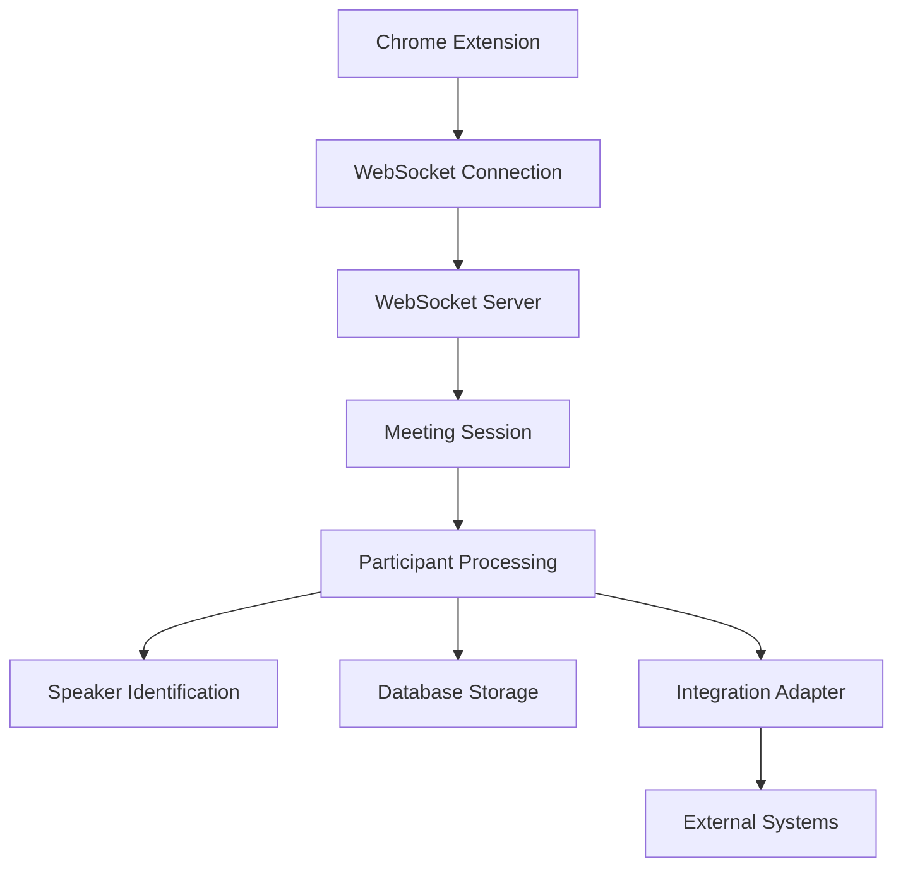

# 🧑‍🤝‍🧑 Participant Data Handling Guide - AI Processing Service

## Overview
This document provides a comprehensive guide to how the AI Processing service handles participant data from the Chrome Extension, including data structures, flow patterns, dependencies, and database storage.

## 📊 Data Flow Architecture



## 🔗 Data Structure Definitions

### 1. Chrome Extension Participant Data
**Source**: `chrome_extension/core/meetingdetector.js`

```javascript
// Enhanced participant data sent from Chrome Extension
{
  id: "participant_abc123",
  name: "John Smith", 
  platform_id: "google-meet-user-xyz",
  status: "active",
  is_host: false,
  join_time: "2025-01-09T10:00:00Z"
}
```

### 2. WebSocket Message Format
**Source**: `ai_processing/app/websocket_server.py`

```javascript
// AUDIO_CHUNK_ENHANCED message format
{
  type: "AUDIO_CHUNK_ENHANCED",
  data: {
    audio_data: "base64_encoded_audio",
    participants: [
      {
        id: "participant_abc123",
        name: "John Smith",
        platform_id: "google-meet-user-xyz", 
        status: "active",
        is_host: false,
        join_time: "2025-01-09T10:00:00Z"
      }
    ],
    participant_count: 3,
    platform: "google-meet",
    metadata: {
      meetingUrl: "https://meet.google.com/abc-defg-hij",
      timestamp: "2025-01-09T10:00:00Z"
    }
  }
}
```

### 3. AI Processing Service Models
**Source**: `ai_processing/app/main.py`

```python
class Participant(BaseModel):
    """Participant data from chrome extension"""
    id: str
    name: str
    platform_id: Optional[str] = None
    status: str = "active"
    join_time: str
    is_host: bool = False
```

**Source**: `ai_processing/app/integration_adapter.py`

```python
class ParticipantData:
    id: str
    name: str
    platform_id: str
    status: str
    is_host: bool
    join_time: str
    leave_time: Optional[str] = None
```

## 🛠️ Processing Components

### 1. WebSocket Server (`websocket_server.py`)

#### MeetingSession Class
```python
class MeetingSession:
    def __init__(self, meeting_id: str, platform: str = "unknown"):
        self.meeting_id = meeting_id
        self.platform = platform
        self.participants: Set[str] = set()  # Legacy: names only
        self.participant_data: Dict[str, Dict] = {}  # Enhanced: full data
        self.participant_count = 0
```

#### Key Methods:

**1. Update Participants**
```python
def update_participants(self, participants_data: List[Dict], participant_count: int = 0):
    """Update participant data from enhanced audio chunk"""
    self.participant_count = participant_count
    
    for participant in participants_data:
        participant_id = participant.get('id')
        if participant_id:
            self.participant_data[participant_id] = participant
            # Also add to legacy participants set
            participant_name = participant.get('name')
            if participant_name:
                self.participants.add(participant_name)
```

**2. Get Participant Names for Speaker Identification**
```python
def get_participant_names(self) -> List[str]:
    """Get list of participant names for speaker identification context"""
    # Prefer enhanced participant data if available
    if self.participant_data:
        return [p.get('name', 'Unknown') for p in self.participant_data.values() if p.get('name')]
    # Fallback to legacy participant set
    return list(self.participants)
```

**3. Convert to Integration Objects**
```python
def get_participant_data_objects(self) -> List[ParticipantData]:
    """Get list of ParticipantData objects for integration adapter"""
    participant_objects = []
    for participant_dict in self.participant_data.values():
        participant_obj = ParticipantData(
            id=participant_dict.get('id', ''),
            name=participant_dict.get('name', ''),
            platform_id=participant_dict.get('platform_id', ''),
            status=participant_dict.get('status', 'unknown'),
            is_host=participant_dict.get('is_host', False),
            join_time=participant_dict.get('join_time', ''),
            leave_time=participant_dict.get('leave_time')
        )
        participant_objects.append(participant_obj)
    return participant_objects
```

### 2. Audio Chunk Processing

```python
async def handle_audio_chunk(self, websocket: WebSocket, message: Dict):
    """Process incoming audio chunk with participant data"""
    
    # Extract participant data from enhanced message
    if message_type == 'AUDIO_CHUNK_ENHANCED':
        participants = message.get('data', {}).get('participants', [])
        participant_count = message.get('data', {}).get('participant_count', 0)
        platform = message.get('data', {}).get('platform', 'unknown')
        
        # Update session participant data
        session.update_participants(participants, participant_count)
    
    # Use participant context for speaker identification
    if transcription_result.get('text'):
        participant_names = session.get_participant_names()
        speaker_info = await session.identify_speakers(
            transcription_result['text'],
            participant_context=participant_names
        )
        transcription_result['speakers'] = speaker_info.get('speakers', [])
```

### 3. Speaker Identification Integration

The participant data is used to enhance speaker identification accuracy:

```python
# Pass participant context to speaker identification
participant_names = session.get_participant_names()
speaker_info = await session.identify_speakers(
    transcription_result['text'],
    participant_context=participant_names
)
```

## 💾 Database Storage

### Database Schema
**Source**: `ai_processing/app/db.py`

```sql
CREATE TABLE IF NOT EXISTS participants (
    id TEXT PRIMARY KEY,                    -- Internal table ID (UUID)
    meeting_id TEXT NOT NULL,               -- Foreign key to meetings table
    participant_id TEXT NOT NULL,           -- Chrome extension participant ID
    name TEXT NOT NULL,                     -- Participant name
    platform_id TEXT NOT NULL,             -- Platform-specific participant ID
    status TEXT NOT NULL,                   -- active, inactive, left
    join_time TEXT NOT NULL,               -- ISO timestamp
    is_host BOOLEAN NOT NULL DEFAULT 0,    -- Host flag
    created_at TEXT NOT NULL,              -- Record creation time
    FOREIGN KEY (meeting_id) REFERENCES meetings(id),
    UNIQUE(meeting_id, participant_id)     -- Prevent duplicates per meeting
)
```

### Storage Operations

#### 1. Batch Participant Save
**Source**: `ai_processing/app/sqlite_database.py` & `ai_processing/app/tidb_database.py`

```python
async def save_participants_batch(self, meeting_id: str, participants: List[Dict]) -> bool:
    """Save multiple participants at once"""
    for participant in participants:
        participant_table_id = f"participant-{uuid.uuid4()}"
        
        # SQLite version uses INSERT OR REPLACE
        cursor.execute("""
            INSERT OR REPLACE INTO participants
            (id, meeting_id, participant_id, name, platform_id, status, join_time, is_host, created_at)
            VALUES (?, ?, ?, ?, ?, ?, ?, ?, ?)
        """, (
            participant_table_id,
            meeting_id,
            participant.get("id", participant.get("participant_id")),
            participant.get("name", "Unknown"),
            participant.get("platform_id", participant.get("id")),
            participant.get("status", "active"),
            participant.get("join_time", current_time),
            int(participant.get("is_host", False)),
            current_time
        ))
        
        # TiDB version uses ON DUPLICATE KEY UPDATE
        # ... similar structure with MySQL-specific syntax
```

#### 2. API Endpoint Integration
**Source**: `ai_processing/app/main.py`

```python
@app.post("/save-transcript")
async def save_transcript(request: SaveTranscriptRequest):
    """Save transcript segments with participant data"""
    
    # Save participants if provided
    if request.participants:
        participants_data = [
            {
                "id": p.id,
                "name": p.name,
                "platform_id": p.platform_id or p.id,
                "status": p.status,
                "join_time": p.join_time,
                "is_host": p.is_host
            }
            for p in request.participants
        ]
        await db.save_participants_batch(meeting_id, participants_data)
```

## 🔄 Integration Flow

### 1. Meeting Processing Workflow
**Source**: `ai_processing/app/websocket_server.py`

```python
async def _generate_meeting_summary(self, session: MeetingSession):
    """Generate comprehensive meeting summary with participant data"""
    
    # Get participant objects for integration
    participant_objects = session.get_participant_data_objects()
    
    # Notify integration systems
    await notify_meeting_processed(
        meeting_id=session.meeting_id,
        meeting_title=f"Meeting {session.meeting_id}",
        platform=session.platform,
        participants=participant_objects,  # Full participant data
        participant_count=session.participant_count,
        transcript=session.cumulative_transcript,
        summary_data=summary,
        tasks_data=tasks,
        speakers_data=speaker_results
    )
```

### 2. Integration Adapter Usage
**Source**: `ai_processing/app/integration_adapter.py`

```python
async def process_meeting_complete(self,
                                 meeting_id: str,
                                 meeting_title: str,
                                 platform: str,
                                 participants: List[ParticipantData],  # Structured participant data
                                 participant_count: int,
                                 transcript: str,
                                 summary_data: Dict,
                                 tasks_data: List[Dict],
                                 speakers_data: List[Dict]) -> Dict:
    
    # Create structured meeting data with participants
    meeting_data = MeetingData(
        meeting_id=meeting_id,
        title=meeting_title,
        platform=platform,
        participants=participants,  # Full participant objects
        participant_count=participant_count,
        duration=self._estimate_duration(transcript),
        transcript=transcript,
        created_at=datetime.now().isoformat()
    )
```

## 📤 Response Formats

### 1. WebSocket Transcription Response
```json
{
  "type": "TRANSCRIPTION_RESULT",
  "data": {
    "text": "Let's review the quarterly results",
    "confidence": 0.92,
    "timestamp": "2025-01-09T10:15:30Z",
    "speaker": "John Smith",
    "speakers": [
      {
        "name": "John Smith",
        "confidence": 0.92,
        "segment": "Let's review the quarterly results"
      }
    ],
    "meetingId": "google-meet_123456",
    "chunkId": 15,
    "speaker_id": "participant_abc123",
    "speaker_confidence": 0.92
  }
}
```

### 2. Meeting Update Broadcast
```json
{
  "type": "MEETING_UPDATE", 
  "data": {
    "meetingId": "google-meet_123456",
    "participants": ["John Smith", "Sarah Johnson"],
    "participant_data": [
      {
        "id": "participant_abc123",
        "name": "John Smith",
        "platform_id": "google-meet-user-xyz",
        "status": "active",
        "is_host": true,
        "join_time": "2025-01-09T10:00:00Z"
      }
    ],
    "participant_count": 2,
    "platform": "google-meet",
    "latestTranscript": "Let's review the quarterly results",
    "timestamp": "2025-01-09T10:15:30Z"
  }
}
```

## 🔧 Dependencies

### Core Dependencies
```txt
# WebSocket handling
websockets>=12.0
fastapi==0.115.9

# Data validation  
pydantic>=2.10,<3.0.0

# Database support
aiosqlite==0.21.0
mysql-connector-python>=8.0.33

# AI processing
openai>=1.51.0
```

### Key Modules
- `websocket_server.py` - WebSocket connection management and participant processing
- `main.py` - FastAPI endpoints and data models
- `integration_adapter.py` - External system integration with participant context
- `sqlite_database.py` / `tidb_database.py` - Database persistence
- `speaker_identifier.py` - AI speaker identification enhanced with participant context

## 🧪 Testing Participant Data

### 1. Mock Server Testing
**Source**: `shared/mock-servers/chrome-extension/simple-websocket-mock.py`

```python
# Mock participant data for testing
"participants": [
    {
        "id": "mock_participant_1",
        "name": "Demo User 1", 
        "is_host": True,
        "status": "active",
        "join_time": datetime.now(timezone.utc).isoformat()
    }
]
```

### 2. Integration Tests
**Source**: `ai_processing/test_focused_unit_tests.py`

```python
class TestIntegrationAdapter(unittest.TestCase):
    def test_participant_data_conversion(self):
        """Test ParticipantData object creation"""
        participant = ParticipantData(
            id="test_123",
            name="Test User",
            platform_id="platform_456", 
            status="active",
            is_host=False,
            join_time="2025-01-09T10:00:00Z"
        )
        self.assertEqual(participant.name, "Test User")
```

## 🚨 Error Handling

### 1. Missing Participant Data
```python
# Graceful fallback when participant data is not available
def get_participant_names(self) -> List[str]:
    if self.participant_data:
        return [p.get('name', 'Unknown') for p in self.participant_data.values()]
    # Fallback to legacy participant set
    return list(self.participants)
```

### 2. Database Constraints
```python
# Handle duplicate participants with UNIQUE constraint
UNIQUE(meeting_id, participant_id)  # Prevent duplicates per meeting
```

### 3. Data Validation
```python
# Pydantic model validation
class Participant(BaseModel):
    id: str
    name: str
    platform_id: Optional[str] = None  # Optional with fallback
    status: str = "active"             # Default value
    join_time: str
    is_host: bool = False              # Default value
```

## 🔄 Migration Notes

### Legacy Support
The system maintains dual support for:
- **Legacy Mode**: Basic participant names only (`Set[str]`)
- **Enhanced Mode**: Full participant objects (`Dict[str, Dict]`)

This allows gradual migration and backward compatibility with older Chrome extension versions.

### Future Improvements
1. **Real-time Updates**: WebSocket events for participant join/leave
2. **Speaker Matching**: Enhanced AI matching using participant voice profiles
3. **Platform Extensions**: Support for more meeting platforms (Teams, Slack, etc.)
4. **Analytics**: Participant engagement tracking and meeting insights

## 📋 Summary

The AI Processing service provides comprehensive participant data handling with:

✅ **Chrome Extension Integration** - Receives enhanced participant data via WebSocket  
✅ **Dual Data Storage** - Legacy names + enhanced participant objects  
✅ **Speaker Enhancement** - Uses participant context for better AI identification  
✅ **Database Persistence** - Structured storage in SQLite/TiDB  
✅ **Integration Ready** - Structured data for external system integration  
✅ **Error Resilient** - Graceful fallbacks for missing data  
✅ **Testing Support** - Comprehensive mock and integration testing  

The participant data flows seamlessly from Chrome extension detection through AI processing to database storage and external integrations, providing rich context for meeting analysis and automation.