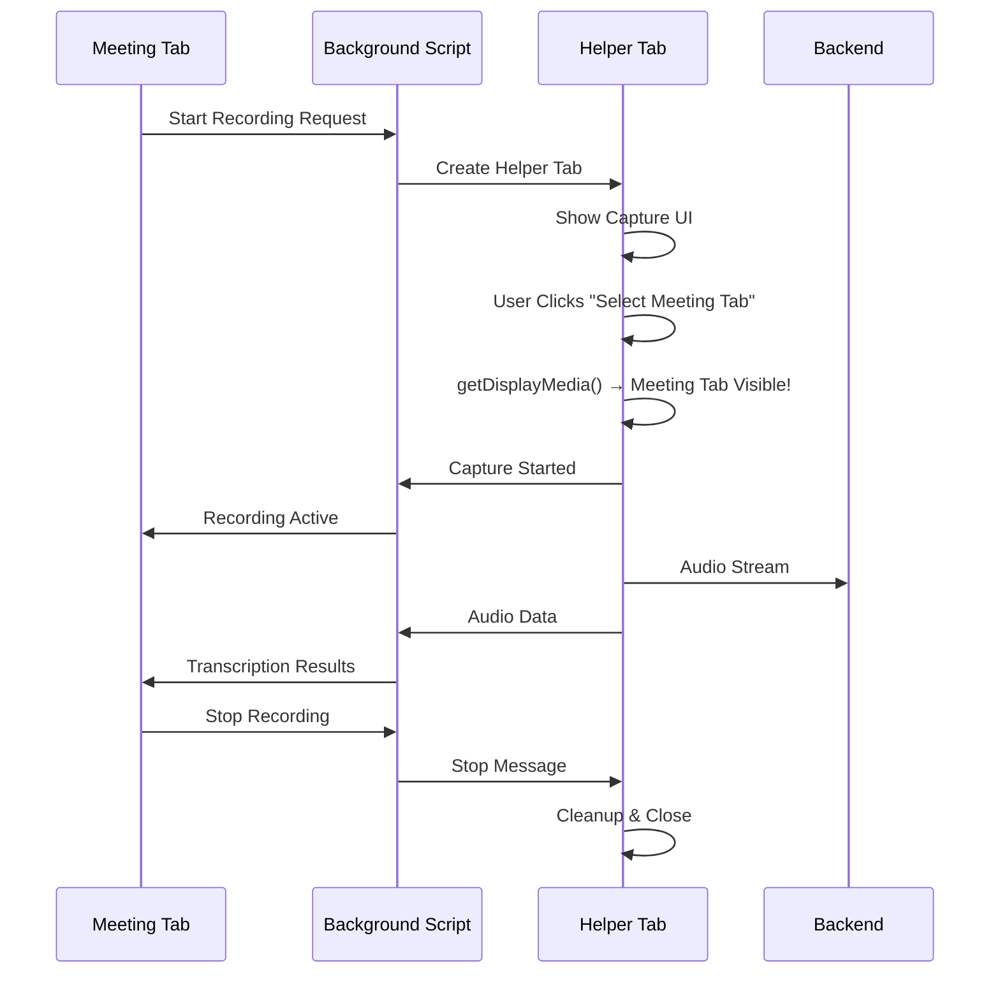
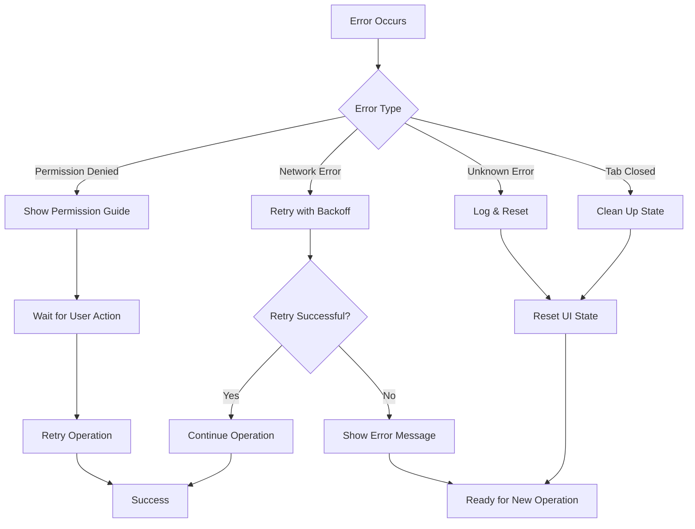

# ScrumBot Chrome Extension - Technical Architecture

## Overview

This document details the engineering architecture behind ScrumBot's multi-tab audio capture solution for meeting transcription. The implementation solves the complex challenge of capturing audio from Google Meet, Zoom, and Teams while working within Chrome's security constraints.

## Table of Contents

- [Problem Statement](#problem-statement)
- [Architecture Overview](#architecture-overview)
- [Core Components](#core-components)
- [Multi-Tab Capture Solution](#multi-tab-capture-solution)
- [Chrome Extension Context Model](#chrome-extension-context-model)
- [Message Passing Architecture](#message-passing-architecture)
- [Audio Processing Pipeline](#audio-processing-pipeline)
- [State Management](#state-management)
- [Error Handling Strategy](#error-handling-strategy)
- [Security Considerations](#security-considerations)
- [Performance Optimizations](#performance-optimizations)
- [Development Environment](#development-environment)
- [Testing Strategy](#testing-strategy)
- [Deployment Guide](#deployment-guide)

## Problem Statement

### The Challenge

Meeting platforms like Google Meet present unique challenges for audio capture:

1. **Chrome Security Restrictions**: `getDisplayMedia()` excludes the requesting tab from sharing options
2. **Meeting Tab Invisibility**: The active meeting tab doesn't appear in Chrome's native sharing dialog
3. **Audio-Only Capture**: Chrome requires video to be requested even for audio-only capture
4. **Cross-Platform Compatibility**: Different meeting platforms handle audio differently
5. **User Experience**: Complex permission flows confuse users

### Previous Approaches and Limitations

```javascript
// ❌ Single-tab approach (FAILED)
navigator.mediaDevices.getDisplayMedia({
  video: false,
  audio: true
});
// Result: Meeting tab never appears in sharing options
```

## Architecture Overview

### High-Level Architecture

```
┌─────────────────┐    ┌─────────────────┐    ┌─────────────────┐
│   Meeting Tab   │    │   Helper Tab    │    │ Background      │
│   (Content)     │    │   (Capture)     │    │ Script          │
├─────────────────┤    ├─────────────────┤    ├─────────────────┤
│ • UI Controls   │    │ • Capture UI    │    │ • Message Router│
│ • Status Display│◄──►│ • Audio Capture │◄──►│ • Tab Manager   │
│ • Meeting       │    │ • Stream Process│    │ • API Coord     │
│   Detection     │    │ • Error Handling│    │ • State Sync    │
└─────────────────┘    └─────────────────┘    └─────────────────┘
         │                       │                       │
         └───────────────────────┼───────────────────────┘
                                 ▼
                    ┌─────────────────────────┐
                    │     Backend Services    │
                    ├─────────────────────────┤
                    │ • WebSocket Server      │
                    │ • REST API Server       │
                    │ • Mock Transcription    │
                    │ • Audio Processing      │
                    └─────────────────────────┘
```

### Component Interaction Flow



## Core Components

### 1. Meeting Detection (`core/meetingdetector.js`)

**Purpose**: Identifies active meeting platforms and monitors meeting state.

```javascript
class MeetingDetector {
  detectPlatform() {
    // Platform-specific detection logic
    if (url.includes('meet.google.com')) return 'google-meet';
    if (url.includes('zoom.us')) return 'zoom';
    if (url.includes('teams.microsoft.com')) return 'teams';
  }

  isInGoogleMeet() {
    // DOM-based meeting detection
    return document.querySelector('[data-call-id]') !== null ||
           document.querySelector('[jsname="HlFzId"]') !== null;
  }
}
```

**Key Features**:
- Real-time meeting state monitoring
- Platform-agnostic detection
- DOM-based presence verification
- Event-driven state changes

### 2. Audio Capture (`core/audiocapture.js`)

**Purpose**: Handles audio stream capture and processing.

```javascript
class AudioCapture {
  async startCapture() {
    // Chrome requires video to be requested
    this.audioStream = await navigator.mediaDevices.getDisplayMedia({
      video: true,  // Required by Chrome API
      audio: {
        echoCancellation: true,
        noiseSuppression: true,
        sampleRate: 16000
      }
    });

    // Remove video tracks, keep only audio
    const videoTracks = this.audioStream.getVideoTracks();
    videoTracks.forEach(track => {
      track.stop();
      this.audioStream.removeTrack(track);
    });
  }
}
```

**Key Features**:
- Chrome API compliance (video + audio request)
- Audio-only processing (video track removal)
- Real-time chunk processing
- Error handling and recovery

### 3. WebSocket Client (`services/websocketclient.js`)

**Purpose**: Real-time communication with backend services.

```javascript
class WebSocketClient {
  constructor() {
    this.serverUrl = window.SCRUMBOT_CONFIG?.WEBSOCKET_URL || 'ws://localhost:8081/ws';
    this.reconnectAttempts = 0;
    this.maxReconnectAttempts = 5;
  }

  sendAudioChunk(audioData, metadata = {}) {
    return this.send({
      type: 'AUDIO_CHUNK',
      data: audioData,
      timestamp: Date.now(),
      metadata: {
        platform: metadata.platform || 'unknown',
        meetingUrl: metadata.meetingUrl || window.location.href,
        chunkSize: audioData.length,
        ...metadata
      }
    });
  }
}
```

**Key Features**:
- Automatic reconnection with exponential backoff
- Message queuing during disconnection
- Metadata enrichment
- Environment-specific configuration

### 4. Background Service Worker (`worker/background.js`)

**Purpose**: Message routing and Chrome API access.

```javascript
// Message routing between contexts
function handleMessage(message, sender, sendResponse) {
  switch(message.type) {
    case 'CREATE_HELPER_TAB':
      handleCreateHelperTab(message, sender, sendResponse);
      break;
    case 'HELPER_TO_MEETING':
      handleHelperToMeeting(message, sender);
      break;
    case 'MEETING_TO_HELPER':
      handleMeetingToHelper(message, sender);
      break;
  }
}
```

**Key Features**:
- Cross-context message routing
- Chrome API access delegation
- Tab lifecycle management
- Error boundary handling

## Multi-Tab Capture Solution

### The Innovation

The multi-tab approach solves Chrome's self-capture restriction by using a helper tab to trigger `getDisplayMedia()`, making the meeting tab visible in the sharing dialog.

### Implementation Details

#### 1. Tab Creation Flow

```javascript
// Content Script (Meeting Tab)
function startMultiTabRecording(button, statusElement) {
  chrome.runtime.sendMessage({
    type: 'CREATE_HELPER_TAB',
    meetingTabId: chrome.runtime.id
  }, (response) => {
    if (response.success) {
      helperTabId = response.tabId;
      // Update UI to guide user
    }
  });
}

// Background Script
function handleCreateHelperTab(message, sender, sendResponse) {
  const captureUrl = chrome.runtime.getURL('capture.html') + 
                    `?meetingTabId=${sender.tab.id}`;
  
  chrome.tabs.create({
    url: captureUrl,
    active: true
  }, (tab) => {
    sendResponse({ success: true, tabId: tab.id });
  });
}
```

#### 2. Helper Tab Interface (`capture.html`)

```html
<!-- Clean, instructional UI -->
<div class="instructions">
  <div class="step">
    <div class="step-number">1</div>
    <div>Click the "Select Meeting Tab" button below</div>
  </div>
  <div class="step">
    <div class="step-number">2</div>
    <div>Choose your <strong>meeting tab</strong> from the sharing dialog</div>
  </div>
  <div class="step">
    <div class="step-number">3</div>
    <div>Make sure <strong>"Also share tab audio"</strong> is enabled</div>
  </div>
  <div class="step">
    <div class="step-number">4</div>
    <div>Click <strong>"Share"</strong> to start recording</div>
  </div>
</div>
```

#### 3. Audio Stream Processing

```javascript
// Helper Tab (capture.js)
class CaptureHelper {
  async startCapture() {
    const success = await this.audioCapture.startCapture();
    if (success) {
      this.setupAudioForwarding();
      this.notifyMeetingTab('CAPTURE_STARTED', { success: true });
    }
  }

  setupAudioForwarding() {
    // Override audio processing to forward to meeting tab
    const originalSendAudio = this.audioCapture.sendAudioToBackend.bind(this.audioCapture);
    
    this.audioCapture.sendAudioToBackend = (audioData) => {
      originalSendAudio(audioData);  // Send to backend
      this.notifyMeetingTab('AUDIO_DATA', { audioData, timestamp: Date.now() });
    };
  }
}
```

## Chrome Extension Context Model

### Context Boundaries and Capabilities

| Context | DOM Access | Chrome APIs | Network | Storage |
|---------|------------|-------------|---------|---------|
| Content Script | ✅ Full | ⚠️ Limited | ✅ Fetch/XHR | ✅ chrome.storage |
| Background Script | ❌ None | ✅ Full | ✅ Fetch | ✅ chrome.storage |
| Popup Script | ✅ Popup DOM | ✅ Full | ✅ Fetch | ✅ chrome.storage |
| Helper Tab | ✅ Tab DOM | ⚠️ Limited | ✅ Fetch/XHR | ✅ chrome.storage |

### API Access Patterns

```javascript
// ❌ WRONG: Content script trying to use chrome.tabs
chrome.tabs.create(options);  // TypeError: Cannot read properties of undefined

// ✅ CORRECT: Content script requesting via background
chrome.runtime.sendMessage({
  type: 'CREATE_HELPER_TAB',
  options: options
});

// ✅ CORRECT: Background script using chrome.tabs
chrome.tabs.create(options, callback);
```

## Message Passing Architecture

### Three-Layer Communication System

#### Layer 1: Runtime Messaging (Cross-Context)

```javascript
// Content Script → Background Script
chrome.runtime.sendMessage(message, callback);

// Background Script → Content Script
chrome.tabs.sendMessage(tabId, message, callback);
```

#### Layer 2: Event-Driven Communication

```javascript
// Event listeners with type-based routing
chrome.runtime.onMessage.addListener((message, sender, sendResponse) => {
  switch(message.type) {
    case 'HELPER_TO_MEETING':
      handleHelperMessage(message.messageType, message.data);
      break;
    case 'MEETING_TO_HELPER':
      handleMeetingMessage(message.messageType, message.data);
      break;
  }
  return true; // Keep channel open for async responses
});
```

#### Layer 3: Message Routing and Transformation

```javascript
// Background script as message bus
function handleHelperToMeeting(message, sender) {
  // Route message to specific meeting tab
  if (message.targetTabId) {
    chrome.tabs.sendMessage(parseInt(message.targetTabId), {
      type: 'HELPER_TO_MEETING',
      messageType: message.messageType,
      data: message.data
    });
  }
}
```

### Message Types and Protocols

```javascript
// Tab Management Messages
{
  type: 'CREATE_HELPER_TAB',
  meetingTabId: string
}

// Capture Control Messages
{
  type: 'HELPER_TO_MEETING',
  messageType: 'CAPTURE_STARTED' | 'CAPTURE_FAILED' | 'AUDIO_DATA' | 'CAPTURE_STOPPED',
  data: object
}

// Recording Control Messages
{
  type: 'MEETING_TO_HELPER',
  messageType: 'STOP_RECORDING' | 'GET_STATUS',
  targetTabId?: number
}
```

## Audio Processing Pipeline

### End-to-End Audio Flow

```
Meeting Audio → Helper Tab Capture → Audio Processing → Multiple Outputs
                      ↓
              ┌─────────────────┐
              │ getDisplayMedia │
              └─────────────────┘
                      ↓
              ┌─────────────────┐
              │ Remove Video    │
              │ Keep Audio Only │
              └─────────────────┘
                      ↓
              ┌─────────────────┐
              │ MediaRecorder   │
              │ 1-2s chunks     │
              └─────────────────┘
                      ↓
              ┌─────────────────┐
              │ Base64 Encoding │
              └─────────────────┘
                      ↓
        ┌─────────────┬─────────────┬─────────────┐
        ▼             ▼             ▼             ▼
   WebSocket      REST API     Meeting Tab   Mock System
   (Real-time)   (Reliable)   (Display)     (Development)
```

### Audio Chunk Processing

```javascript
setupRecorderEvents() {
  this.mediaRecorder.ondataavailable = (event) => {
    if (event.data.size > 0) {
      this.audioChunks.push(event.data);
      this.processAudioChunk(event.data);
    }
  };
}

processAudioChunk(audioBlob) {
  const reader = new FileReader();
  reader.onload = () => {
    const base64Audio = reader.result.split(',')[1];
    this.sendAudioToBackend(base64Audio);
  };
  reader.readAsDataURL(audioBlob);
}
```

### Multi-Output Distribution

```javascript
sendAudioToBackend(audioData) {
  // 1. WebSocket for real-time processing
  if (this.webSocketClient?.isConnected) {
    this.webSocketClient.sendAudioChunk(audioData, metadata);
  }
  
  // 2. REST API for reliable storage
  this.sendToRestAPI(audioData);
  
  // 3. Forward to meeting tab for display
  this.notifyMeetingTab('AUDIO_DATA', { audioData });
  
  // 4. Mock transcription in development
  if (window.SCRUMBOT_CONFIG.MOCK_TRANSCRIPTION) {
    this.handleMockTranscription(audioData);
  }
}
```

## State Management

### Distributed State Architecture

The extension manages state across multiple contexts, requiring careful synchronization:

#### Meeting Tab State

```javascript
// content.js - Meeting tab state
let helperTabId = null;              // Reference to helper tab
let isRecordingViaHelper = false;    // Recording status
let meetingId = null;                // Unique meeting identifier
```

#### Helper Tab State

```javascript
// capture.js - Helper tab state
let audioCapture = null;             // Audio capture instance
let isCapturing = false;             // Capture status
let meetingTabId = null;             // Reference to meeting tab
```

#### Background Script State

```javascript
// background.js - Global state coordination
let activeHelperTabs = new Map();    // Helper tab registry
let meetingTabMappings = new Map();  // Meeting → Helper mappings
```

### State Synchronization Patterns

#### 1. Event-Driven State Updates

```javascript
// State change propagation
function notifyStateChange(newState) {
  // Update local state
  this.currentState = newState;
  
  // Propagate to other contexts
  chrome.runtime.sendMessage({
    type: 'STATE_CHANGE',
    state: newState,
    timestamp: Date.now()
  });
}
```

#### 2. State Validation and Recovery

```javascript
// Periodic state validation
setInterval(() => {
  validateStateConsistency();
}, 5000);

function validateStateConsistency() {
  // Check if helper tab still exists
  if (helperTabId) {
    chrome.tabs.get(helperTabId, (tab) => {
      if (chrome.runtime.lastError) {
        // Helper tab was closed, clean up state
        resetRecordingState();
      }
    });
  }
}
```

## Error Handling Strategy

### Multi-Layer Error Handling

#### 1. Context-Specific Error Boundaries

```javascript
// Content Script Error Handling
try {
  await startMultiTabRecording();
} catch (error) {
  console.error('[Content] Recording failed:', error);
  showUserError('Failed to start recording. Please try again.');
  resetUIState();
}

// Background Script Error Handling
chrome.tabs.create(options, (tab) => {
  if (chrome.runtime.lastError) {
    console.error('[Background] Tab creation failed:', chrome.runtime.lastError);
    sendResponse({ success: false, error: chrome.runtime.lastError.message });
  }
});

// Helper Tab Error Handling
window.addEventListener('error', (event) => {
  console.error('[Helper] Unhandled error:', event.error);
  notifyMeetingTab('CAPTURE_FAILED', { error: event.error.message });
});
```

#### 2. User-Facing Error Messages

```javascript
// Error categorization and user guidance
function handleAudioCaptureError(error) {
  switch(error.name) {
    case 'NotAllowedError':
      showError('Please allow screen sharing with audio to start recording');
      break;
    case 'NotFoundError':
      showError('No audio source found. Make sure you\'re in an active meeting');
      break;
    case 'NotSupportedError':
      showError('Audio capture not supported in this browser');
      break;
    default:
      showError(`Recording failed: ${error.message}`);
  }
}
```

#### 3. Automatic Recovery Mechanisms

```javascript
// Retry logic with exponential backoff
class RetryManager {
  async executeWithRetry(operation, maxRetries = 3) {
    for (let attempt = 1; attempt <= maxRetries; attempt++) {
      try {
        return await operation();
      } catch (error) {
        if (attempt === maxRetries) throw error;
        
        const delay = Math.pow(2, attempt) * 1000; // Exponential backoff
        await new Promise(resolve => setTimeout(resolve, delay));
      }
    }
  }
}
```

### Error Recovery Flows



## Security Considerations

### 1. Input Validation and Sanitization

```javascript
// Message validation
function validateMessage(message, sender) {
  // Validate message structure
  if (!message.type || typeof message.type !== 'string') {
    throw new Error('Invalid message format');
  }
  
  // Validate sender origin
  const allowedOrigins = [
    'https://meet.google.com',
    'https://zoom.us',
    'https://teams.microsoft.com'
  ];
  
  if (!allowedOrigins.some(origin => sender.tab.url.startsWith(origin))) {
    throw new Error('Unauthorized sender origin');
  }
}

// Audio data validation
function validateAudioData(audioData) {
  // Check data size limits
  if (audioData.length > MAX_AUDIO_CHUNK_SIZE) {
    throw new Error('Audio chunk too large');
  }
  
  // Validate base64 format
  if (!/^[A-Za-z0-9+/]*={0,2}$/.test(audioData)) {
    throw new Error('Invalid audio data format');
  }
}
```

### 2. Permission Management

```javascript
// Minimal permission principle
const REQUIRED_PERMISSIONS = [
  'activeTab',      // Access to current tab only
  'scripting',      // Content script injection
  'tabs',           // Tab management for helper tabs
  'storage',        // Local data storage
  'tabCapture'      // Audio capture capability
];

// Runtime permission checks
function checkPermissions() {
  chrome.permissions.contains({
    permissions: REQUIRED_PERMISSIONS
  }, (hasPermissions) => {
    if (!hasPermissions) {
      requestPermissions();
    }
  });
}
```

### 3. Data Protection

```javascript
// Secure data transmission
function secureTransmit(data) {
  // Encrypt sensitive data
  const encrypted = encrypt(data, getSessionKey());
  
  // Add integrity check
  const checksum = calculateChecksum(encrypted);
  
  return {
    data: encrypted,
    checksum: checksum,
    timestamp: Date.now()
  };
}

// Secure storage
function secureStore(key, value) {
  const encryptedValue = encrypt(JSON.stringify(value), getStorageKey());
  chrome.storage.local.set({ [key]: encryptedValue });
}
```

### 4. Content Security Policy

```json
// manifest.json CSP configuration
{
  "content_security_policy": {
    "extension_pages": "script-src 'self'; object-src 'self'; connect-src 'self' ws://localhost:* wss://*.ngrok-free.app;"
  }
}
```

## Performance Optimizations

### 1. Memory Management

```javascript
// Efficient audio chunk handling
class AudioChunkManager {
  constructor() {
    this.chunkBuffer = [];
    this.maxBufferSize = 10; // Keep only recent chunks
  }
  
  addChunk(chunk) {
    this.chunkBuffer.push(chunk);
    
    // Prevent memory leaks
    if (this.chunkBuffer.length > this.maxBufferSize) {
      this.chunkBuffer.shift(); // Remove oldest chunk
    }
  }
  
  cleanup() {
    this.chunkBuffer = [];
  }
}
```

### 2. Network Optimization

```javascript
// Batch audio transmission
class AudioBatcher {
  constructor() {
    this.batch = [];
    this.batchSize = 5;
    this.batchTimeout = 2000;
  }
  
  addAudioChunk(chunk) {
    this.batch.push(chunk);
    
    if (this.batch.length >= this.batchSize) {
      this.flushBatch();
    } else {
      this.scheduleBatchFlush();
    }
  }
  
  flushBatch() {
    if (this.batch.length > 0) {
      this.transmitBatch(this.batch);
      this.batch = [];
    }
  }
}
```

### 3. Resource Cleanup

```javascript
// Automatic resource cleanup
class ResourceManager {
  constructor() {
    this.resources = new Set();
    this.setupCleanupHandlers();
  }
  
  register(resource) {
    this.resources.add(resource);
  }
  
  cleanup() {
    for (const resource of this.resources) {
      if (resource.cleanup) {
        resource.cleanup();
      }
    }
    this.resources.clear();
  }
  
  setupCleanupHandlers() {
    // Clean up on tab close
    window.addEventListener('beforeunload', () => this.cleanup());
    
    // Clean up on extension disable
    chrome.runtime.onSuspend?.addListener(() => this.cleanup());
  }
}
```

## Development Environment

### Environment Configuration System

The extension supports multiple environments with different configurations:

```javascript
// config.js - Environment-based configuration
const ENVIRONMENT = 'dev'; // 'dev' | 'prod'

const CONFIGS = {
  dev: {
    BACKEND_URL: 'http://localhost:3002',
    WEBSOCKET_URL: 'ws://localhost:8081/ws',
    MOCK_TRANSCRIPTION: true,
    DEBUG: true,
    AUDIO_CHUNK_INTERVAL: 2000
  },
  prod: {
    BACKEND_URL: 'https://your-backend.ngrok-free.app',
    WEBSOCKET_URL: 'wss://your-backend.ngrok-free.app/ws/audio-stream',
    MOCK_TRANSCRIPTION: false,
    DEBUG: false,
    AUDIO_CHUNK_INTERVAL: 1000
  }
};
```

### Mock Server Architecture

Development includes comprehensive mock servers for offline testing:

#### WebSocket Mock Server

```javascript
// mocks/mockwebsocketserver.js
const WebSocket = require('ws');
const wss = new WebSocket.Server({ port: 8081 });

wss.on('connection', (ws) => {
  ws.on('message', (data) => {
    const message = JSON.parse(data);
    
    switch(message.type) {
      case 'HANDSHAKE':
        ws.send(JSON.stringify({
          type: 'HANDSHAKE_ACK',
          serverVersion: '1.0',
          status: 'ready'
        }));
        break;
        
      case 'AUDIO_CHUNK':
        // Mock transcription response
        setTimeout(() => {
          ws.send(JSON.stringify({
            type: 'TRANSCRIPTION_RESULT',
            data: {
              text: generateMockTranscription(),
              confidence: 0.85 + Math.random() * 0.15,
              timestamp: message.timestamp
            }
          }));
        }, 200 + Math.random() * 300);
        break;
    }
  });
});
```

#### REST API Mock Server

```javascript
// mocks/mockrestserver.js
const http = require('http');
const server = http.createServer((req, res) => {
  // CORS headers
  res.setHeader('Access-Control-Allow-Origin', '*');
  res.setHeader('Access-Control-Allow-Methods', 'GET, POST, PUT, DELETE, OPTIONS');
  res.setHeader('Access-Control-Allow-Headers', 'Content-Type, Authorization, ngrok-skip-browser-warning');
  
  const path = url.parse(req.url).pathname;
  
  switch(path) {
    case '/health':
      res.end(JSON.stringify({ status: 'healthy', server: 'mock-rest-api' }));
      break;
    case '/save-transcript':
      handleSaveTranscript(req, res);
      break;
    case '/transcribe':
      handleMockTranscription(req, res);
      break;
  }
});
```

### Development Scripts

```json
// package.json scripts
{
  "scripts": {
    "dev": "node start-dev-servers.js",
    "env:dev": "node switch-env.js dev",
    "env:prod": "node switch-env.js prod",
    "test:ws": "node mocks/mockwebsocketserver.js",
    "test:rest": "node mocks/mockrestserver.js",
    "test:core": "node test/core.js"
  }
}
```

## Testing Strategy

### Multi-Level Testing Approach

#### 1. Component Testing

```javascript
// test/core.js - Component-level tests
class CoreIntegrationTest {
  async testMeetingDetection() {
    const detector = new MeetingDetector();
    detector.detect();
    assert.strictEqual(detector.platform, 'google-meet');
  }
  
  async testAudioCapture() {
    const audioCapture = new AudioCapture();
    const success = await audioCapture.startCapture();
    assert.strictEqual(success, true);
  }
  
  async testWebSocketConnection() {
    const wsClient = new WebSocketClient();
    await wsClient.connect();
    assert.strictEqual(wsClient.isConnected, true);
  }
}
```

#### 2. Integration Testing

```javascript
// test/integration.js - End-to-end integration tests
class EpicAIntegrationTest {
  async runAllTests() {
    await this.testMeetingDetection();
    await this.testAudioCapture();
    await this.testWebSocketConnection();
    await this.testExtensionUI();
    this.printResults();
  }
  
  async testMultiTabFlow() {
    // Test complete multi-tab capture flow
    const helperTab = await createHelperTab();
    const captureResult = await helperTab.startCapture();
    assert.strictEqual(captureResult.success, true);
  }
}
```

#### 3. Mock Testing

```javascript
// test-multitab.js - Multi-tab specific tests
function testMultiTabCapture() {
  // Test helper tab URL generation
  const captureUrl = chrome.runtime.getURL('capture.html') + '?meetingTabId=test123';
  console.log('✅ Capture URL generated:', captureUrl);
  
  // Test file accessibility
  const requiredFiles = ['capture.html', 'capture.js', 'config.js'];
  requiredFiles.forEach(file => {
    const url = chrome.runtime.getURL(file);
    console.log(`✅ ${file}: ${url}`);
  });
  
  // Test message passing
  chrome.runtime.sendMessage({
    type: 'HELPER_TO_MEETING',
    messageType: 'TEST_MESSAGE',
    data: { test: true }
  });
}
```

### Testing Checklist

- [ ] **Component Loading**: All components initialize correctly
- [ ] **Meeting Detection**: Platform detection works on all supported sites
- [ ] **Audio Capture**: Permissions granted and audio stream captured
- [ ] **Multi-Tab Flow**: Helper tab opens and meeting tab appears in sharing
- [ ] **Cross-Tab Communication**: Messages pass correctly between contexts
- [ ] **Error Handling**: Graceful failure and recovery
- [ ] **Resource Cleanup**: No memory leaks or orphaned resources
- [ ] **Mock Integration**: Development servers respond correctly
- [ ] **State Synchronization**: State remains consistent across contexts

## Deployment Guide

### Pre-Deployment Checklist

#### 1. Environment Configuration

```bash
# Switch to production mode
npm run env:prod

# Verify production configuration
grep -n "ENVIRONMENT.*prod" config.js
```

#### 2. Build Verification

```bash
# Test all components
npm run test:core

# Verify file accessibility
chrome://extensions/ → Load unpacked → Test on meeting platform
```

#### 3. Security Review

- [ ] Remove debug logging from production
- [ ] Validate all user inputs
- [ ] Check CSP configuration
- [ ] Verify permission minimization
- [ ] Test error handling paths

#### 4. Performance Optimization

```javascript
// Remove development-only code
if (window.SCRUMBOT_CONFIG.DEBUG) {
  // This code will not run in production
  console.log('Debug information');
}

// Optimize audio chunk intervals
const chunkInterval = window.SCRUMBOT_CONFIG.ENVIRONMENT === 'prod' ? 1000 : 2000;
```

### Chrome Web Store Deployment

#### 1. Manifest Preparation

```json
{
  "name": "ScrumBot - AI Meeting Assistant",
  "version": "1.0.0",
  "description": "AI-powered meeting transcription with multi-tab audio capture",
  "permissions": [
    "activeTab",
    "scripting", 
    "tabs",
    "storage",
    "tabCapture"
  ],
  "host_permissions": [
    "https://meet.google.com/*",
    "https://zoom.us/*",
    "https://teams.microsoft.com/*"
  ]
}
```

#### 2. Privacy Policy Requirements

Due to audio capture capabilities, a comprehensive privacy policy is required:

- Data collection practices
- Audio processing methods
- Storage and retention policies
- Third-party integrations
- User consent mechanisms

#### 3. Store Listing Optimization

- Clear description of multi-tab capture innovation
- Screenshots showing the helper tab flow
- Video demonstration of the capture process
- Detailed permission explanations

### Production Monitoring

#### 1. Error Tracking

```javascript
// Production error reporting
function reportError(error, context) {
  if (window.SCRUMBOT_CONFIG.ENVIRONMENT === 'prod') {
    // Send to error tracking service
    fetch('/api/errors', {
      method: 'POST',
      body: JSON.stringify({
        error: error.message,
        stack: error.stack,
        context: context,
        timestamp: Date.now(),
        userAgent: navigator.userAgent
      })
    });
  }
}
```

#### 2. Usage Analytics

```javascript
// Track feature usage
function trackUsage(event, data) {
  if (window.SCRUMBOT_CONFIG.ENVIRONMENT === 'prod') {
    // Send to analytics service
    chrome.storage.local.get(['userId'], (result) => {
      analytics.track(event, {
        ...data,
        userId: result.userId,
        timestamp: Date.now()
      });
    });
  }
}
```

## Conclusion

The ScrumBot Chrome Extension represents a sophisticated solution to the complex challenge of meeting audio capture. The multi-tab architecture successfully navigates Chrome's security constraints while providing a seamless user experience.

### Key Innovations

1. **Multi-Tab Capture Pattern**: Solves Chrome's self-capture restriction
2. **Context-Aware Architecture**: Proper separation of concerns across Chrome contexts
3. **Robust Error Handling**: Comprehensive error recovery and user guidance
4. **Development Environment**: Complete offline testing with mock servers
5. **Security-First Design**: Input validation, permission minimization, and secure communication

### Technical Achievements

- **Cross-Context Communication**: Sophisticated message passing architecture
- **State Management**: Distributed state synchronization across multiple contexts
- **Audio Processing Pipeline**: Efficient real-time audio capture and processing
- **User Experience**: Intuitive multi-step capture flow with clear guidance
- **Development Workflow**: Environment switching and comprehensive testing

This architecture serves as a reference implementation for complex Chrome extension development, demonstrating advanced patterns for cross-context communication, state management, and user experience design within Chrome's security model.

---

**Version**: 1.0.0  
**Last Updated**: August 2025  
**Authors**: ScrumBot Development Team  
**License**: MIT