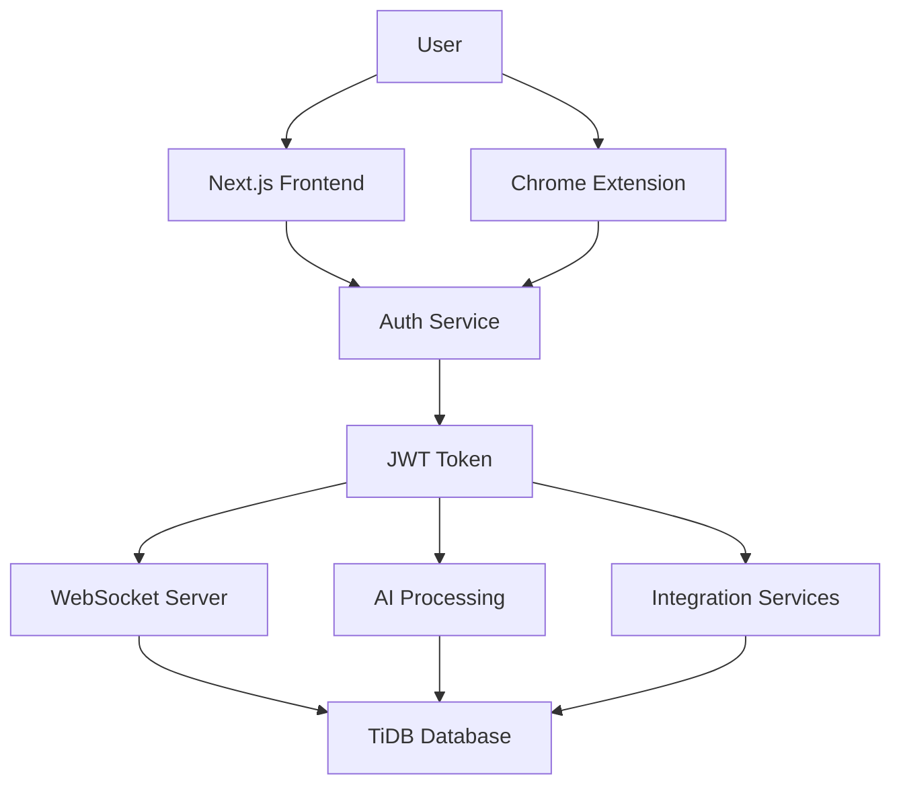

# ScrumBot Authentication Strategy Report
## End-to-End User Authentication Implementation Plan

### Executive Summary

This report analyzes the ScrumBot codebase architecture and provides a comprehensive strategy for implementing user authentication across all system layers. The system currently operates without authentication, requiring a phased approach to integrate secure user management while maintaining existing functionality.

---

## 1. Current Architecture Analysis

### 1.1 System Components

**Frontend Layer:**
- **Next.js Dashboard** (`frontend_dashboard/`) - React-based web interface
- **Chrome Extension** (`chrome_extension/`) - Browser-based audio capture client

**Backend Layer:**
- **WebSocket Server** (`ai_processing/app/websocket_server.py`) - Real-time audio processing
- **AI Processing Engine** (`ai_processing/app/`) - Transcription and task extraction
- **Integration Layer** (`integration/app/`) - External service connections

**Data Layer:**
- **TiDB Serverless** - Primary database for meetings, transcripts, tasks
- **Session Management** - In-memory WebSocket session tracking

### 1.2 Current Security Gaps

```
❌ No user authentication or authorization
❌ Open WebSocket connections without user validation
❌ Chrome extension operates without user identity
❌ Database records not associated with users
❌ No access control for meetings or tasks
❌ Integration services lack user context
```

---

## 2. Authentication Architecture Strategy

### 2.1 Recommended Authentication Flow



### 2.2 Technology Stack Selection

**Authentication Provider:** Auth0 / Firebase Auth / Supabase Auth
- **Rationale:** Managed service reduces implementation complexity
- **Features:** OAuth providers, JWT tokens, user management UI
- **Integration:** SDKs available for Next.js and Chrome extensions

**Token Management:** JWT (JSON Web Tokens)
- **Access Tokens:** Short-lived (15 minutes) for API access
- **Refresh Tokens:** Long-lived (7 days) for token renewal
- **Storage:** Secure storage in browser (httpOnly cookies + localStorage)

---

## 3. Implementation Plan by Layer

### 3.1 Phase 1: Database Schema Updates

**New Tables Required:**

```sql
-- Users table
CREATE TABLE users (
    id VARCHAR(255) PRIMARY KEY,
    email VARCHAR(255) UNIQUE NOT NULL,
    name VARCHAR(255) NOT NULL,
    avatar_url VARCHAR(500),
    auth_provider VARCHAR(50) NOT NULL,
    auth_provider_id VARCHAR(255) NOT NULL,
    subscription_tier VARCHAR(50) DEFAULT 'free',
    created_at TIMESTAMP DEFAULT CURRENT_TIMESTAMP,
    updated_at TIMESTAMP DEFAULT CURRENT_TIMESTAMP ON UPDATE CURRENT_TIMESTAMP,
    last_login TIMESTAMP,
    is_active BOOLEAN DEFAULT TRUE,
    
    INDEX idx_email (email),
    INDEX idx_auth_provider (auth_provider, auth_provider_id)
);

-- User sessions table
CREATE TABLE user_sessions (
    id VARCHAR(255) PRIMARY KEY,
    user_id VARCHAR(255) NOT NULL,
    websocket_id VARCHAR(255),
    device_info JSON,
    ip_address VARCHAR(45),
    user_agent TEXT,
    created_at TIMESTAMP DEFAULT CURRENT_TIMESTAMP,
    expires_at TIMESTAMP NOT NULL,
    is_active BOOLEAN DEFAULT TRUE,
    
    FOREIGN KEY (user_id) REFERENCES users(id) ON DELETE CASCADE,
    INDEX idx_user_active (user_id, is_active),
    INDEX idx_expires (expires_at)
);

-- Update existing tables to include user_id
ALTER TABLE meetings ADD COLUMN user_id VARCHAR(255) NOT NULL;
ALTER TABLE meetings ADD FOREIGN KEY (user_id) REFERENCES users(id) ON DELETE CASCADE;
ALTER TABLE meetings ADD INDEX idx_user_meetings (user_id, created_at);

ALTER TABLE tasks ADD COLUMN user_id VARCHAR(255) NOT NULL;
ALTER TABLE tasks ADD FOREIGN KEY (user_id) REFERENCES users(id) ON DELETE CASCADE;
ALTER TABLE tasks ADD INDEX idx_user_tasks (user_id, status);
```

### 3.2 Phase 2: Authentication Service Layer

**New Files to Create:**

```
ai_processing/app/auth/
├── auth_service.py          # Core authentication logic
├── jwt_manager.py           # JWT token handling
├── user_manager.py          # User CRUD operations
├── session_manager.py       # Session management
└── middleware.py            # Authentication middleware
```

**Core Authentication Service:**

```python
# ai_processing/app/auth/auth_service.py
class AuthService:
    def __init__(self, auth_provider_config):
        self.provider = auth_provider_config
        self.jwt_manager = JWTManager()
        self.user_manager = UserManager()
    
    async def authenticate_token(self, token: str) -> Optional[User]:
        """Validate JWT token and return user"""
        
    async def create_user_session(self, user_id: str, websocket_id: str) -> str:
        """Create authenticated session"""
        
    async def validate_websocket_connection(self, token: str) -> bool:
        """Validate WebSocket connection with JWT"""
```

### 3.3 Phase 3: WebSocket Server Authentication

**Updates Required in `websocket_server.py`:**

```python
# Add authentication to WebSocket connections
class WebSocketManager:
    async def connect(self, websocket: WebSocket, client_info: Dict):
        # Extract JWT token from connection headers or query params
        token = self._extract_auth_token(websocket)
        
        if not token:
            await websocket.close(code=4001, reason="Authentication required")
            return
            
        # Validate token and get user
        user = await self.auth_service.authenticate_token(token)
        if not user:
            await websocket.close(code=4001, reason="Invalid token")
            return
            
        # Store user context in connection
        connection_info = {
            'user_id': user.id,
            'user_email': user.email,
            'connected_at': datetime.now(),
            'client_info': client_info,
            'meeting_session': None
        }
        
        self.active_connections[websocket] = connection_info
        
    async def handle_audio_chunk(self, websocket: WebSocket, message: Dict):
        # Get user context from connection
        connection_info = self.active_connections.get(websocket)
        if not connection_info:
            return
            
        user_id = connection_info['user_id']
        
        # Associate meeting with user
        meeting_id = f"{platform}_{user_id}_{hash(meeting_url) % 1000000}"
        
        # Continue with existing logic...
```

### 3.4 Phase 4: Chrome Extension Authentication

**Updates Required in Chrome Extension:**

```javascript
// chrome_extension/auth/auth_manager.js
class AuthManager {
    constructor() {
        this.token = null;
        this.refreshToken = null;
        this.user = null;
    }
    
    async authenticate() {
        // Redirect to auth provider or show login popup
        const authResult = await this.initiateAuth();
        
        if (authResult.success) {
            this.token = authResult.accessToken;
            this.refreshToken = authResult.refreshToken;
            this.user = authResult.user;
            
            // Store in Chrome storage
            await chrome.storage.local.set({
                'scrumbot_token': this.token,
                'scrumbot_refresh_token': this.refreshToken,
                'scrumbot_user': this.user
            });
        }
    }
    
    async getValidToken() {
        if (!this.token) {
            await this.loadStoredAuth();
        }
        
        if (this.isTokenExpired()) {
            await this.refreshAccessToken();
        }
        
        return this.token;
    }
}

// Update WebSocket connection in content.js
async function initializeWebSocket() {
    const authManager = new AuthManager();
    const token = await authManager.getValidToken();
    
    if (!token) {
        console.error("No valid authentication token");
        return;
    }
    
    const wsUrl = `${config.WEBSOCKET_URL}?token=${token}`;
    websocket = new WebSocket(wsUrl);
    
    // Continue with existing logic...
}
```

### 3.5 Phase 5: Next.js Frontend Authentication

**Updates Required in Frontend Dashboard:**

```javascript
// frontend_dashboard/lib/auth.js
import { createContext, useContext, useEffect, useState } from 'react';

const AuthContext = createContext();

export function AuthProvider({ children }) {
    const [user, setUser] = useState(null);
    const [loading, setLoading] = useState(true);
    
    useEffect(() => {
        // Initialize auth state
        checkAuthState();
    }, []);
    
    const login = async (email, password) => {
        // Implement login logic
    };
    
    const logout = async () => {
        // Implement logout logic
    };
    
    return (
        <AuthContext.Provider value={{ user, login, logout, loading }}>
            {children}
        </AuthContext.Provider>
    );
}

export const useAuth = () => useContext(AuthContext);
```

**Protected Routes:**

```javascript
// frontend_dashboard/components/ProtectedRoute.js
import { useAuth } from '@/lib/auth';
import { useRouter } from 'next/router';

export default function ProtectedRoute({ children }) {
    const { user, loading } = useAuth();
    const router = useRouter();
    
    useEffect(() => {
        if (!loading && !user) {
            router.push('/login');
        }
    }, [user, loading]);
    
    if (loading) return <div>Loading...</div>;
    if (!user) return null;
    
    return children;
}
```

### 3.6 Phase 6: Integration Services Authentication

**Updates Required in Integration Layer:**

```python
# integration/app/auth_integration.py
class AuthenticatedIntegrationService:
    def __init__(self, user_id: str):
        self.user_id = user_id
        self.user_config = self._load_user_config()
    
    async def create_notion_task(self, task_data: Dict) -> str:
        # Use user-specific Notion credentials
        notion_token = self.user_config.get('notion_token')
        if not notion_token:
            raise AuthenticationError("User has not connected Notion")
            
        # Continue with task creation...
    
    async def send_slack_notification(self, message: str) -> bool:
        # Use user-specific Slack credentials
        slack_token = self.user_config.get('slack_token')
        if not slack_token:
            raise AuthenticationError("User has not connected Slack")
            
        # Continue with notification...
```

---

## 4. Security Considerations

### 4.1 Token Security

**JWT Token Structure:**
```json
{
  "sub": "user_id",
  "email": "user@example.com",
  "name": "User Name",
  "iat": 1640995200,
  "exp": 1640996100,
  "aud": "scrumbot-api",
  "iss": "scrumbot-auth"
}
```

**Security Measures:**
- Short-lived access tokens (15 minutes)
- Secure refresh token rotation
- Token blacklisting for logout
- Rate limiting on authentication endpoints
- HTTPS-only token transmission

### 4.2 WebSocket Security

**Connection Authentication:**
- JWT token validation on connection
- Session-based connection tracking
- Automatic disconnection on token expiry
- User-scoped meeting access

**Message Authorization:**
- Validate user permissions for each message
- Ensure users can only access their own meetings
- Prevent cross-user data leakage

### 4.3 Chrome Extension Security

**Token Storage:**
- Use Chrome's secure storage API
- Encrypt sensitive data
- Clear tokens on extension uninstall
- Implement token refresh logic

**Content Security:**
- Validate all external communications
- Sanitize user inputs
- Implement CSP headers
- Use secure WebSocket connections (WSS)

---

## 5. Migration Strategy

### 5.1 Backward Compatibility

**Phase 1: Dual Mode Operation**
- Support both authenticated and anonymous users
- Gradual migration of existing data
- Feature flags for authentication requirements

**Phase 2: Data Migration**
- Create default user accounts for existing data
- Associate orphaned meetings with system user
- Preserve existing functionality during transition

### 5.2 Rollout Plan

**Week 1-2: Database Schema**
- Update TiDB schema with user tables
- Implement data migration scripts
- Test schema changes

**Week 3-4: Backend Authentication**
- Implement authentication service
- Update WebSocket server
- Add JWT middleware

**Week 5-6: Frontend Integration**
- Add authentication to Next.js dashboard
- Implement login/logout flows
- Create protected routes

**Week 7-8: Chrome Extension**
- Add authentication to extension
- Update WebSocket connections
- Test cross-platform authentication

**Week 9-10: Integration Services**
- Update integration layer
- Add user-specific configurations
- Test end-to-end flows

---

## 6. Implementation Checklist

### 6.1 Database Layer
- [ ] Create user management tables
- [ ] Add user_id foreign keys to existing tables
- [ ] Implement data migration scripts
- [ ] Add database indexes for performance
- [ ] Create user session management

### 6.2 Authentication Service
- [ ] Choose authentication provider (Auth0/Firebase/Supabase)
- [ ] Implement JWT token management
- [ ] Create user registration/login flows
- [ ] Add password reset functionality
- [ ] Implement session management

### 6.3 WebSocket Server
- [ ] Add JWT token validation
- [ ] Update connection handling
- [ ] Implement user-scoped sessions
- [ ] Add authorization middleware
- [ ] Update meeting creation logic

### 6.4 Chrome Extension
- [ ] Add authentication UI
- [ ] Implement token storage
- [ ] Update WebSocket connections
- [ ] Add login/logout functionality
- [ ] Handle token refresh

### 6.5 Frontend Dashboard
- [ ] Add authentication context
- [ ] Create login/register pages
- [ ] Implement protected routes
- [ ] Add user profile management
- [ ] Update API calls with auth headers

### 6.6 Integration Services
- [ ] Add user-specific configurations
- [ ] Update Notion integration
- [ ] Update Slack integration
- [ ] Implement OAuth flows for integrations
- [ ] Add user permission management

---

## 7. Testing Strategy

### 7.1 Unit Tests
- Authentication service functions
- JWT token validation
- User management operations
- Session handling logic

### 7.2 Integration Tests
- End-to-end authentication flows
- WebSocket connection with auth
- Chrome extension authentication
- Cross-service communication

### 7.3 Security Tests
- Token validation edge cases
- Session hijacking prevention
- Cross-user data access prevention
- Rate limiting effectiveness

---

## 8. Monitoring and Analytics

### 8.1 Authentication Metrics
- User registration rates
- Login success/failure rates
- Token refresh frequency
- Session duration analytics

### 8.2 Security Monitoring
- Failed authentication attempts
- Suspicious activity detection
- Token usage patterns
- Cross-user access attempts

---

## 9. Cost and Resource Estimation

### 9.1 Development Effort
- **Database Updates:** 1-2 weeks
- **Authentication Service:** 2-3 weeks
- **WebSocket Integration:** 1-2 weeks
- **Chrome Extension:** 2-3 weeks
- **Frontend Dashboard:** 2-3 weeks
- **Integration Services:** 1-2 weeks
- **Testing & QA:** 2-3 weeks

**Total Estimated Time:** 11-18 weeks

### 9.2 Infrastructure Costs
- Authentication provider: $0-50/month (depending on user volume)
- Additional TiDB storage: ~$10-30/month
- SSL certificates: $0 (Let's Encrypt)
- Monitoring tools: $0-20/month

---

## 10. Conclusion

The implementation of end-to-end authentication for ScrumBot requires a comprehensive approach across all system layers. The phased implementation strategy ensures minimal disruption to existing functionality while providing robust security and user management capabilities.

**Key Success Factors:**
1. **Gradual Migration:** Maintain backward compatibility during transition
2. **Security First:** Implement proper token management and validation
3. **User Experience:** Seamless authentication across all platforms
4. **Scalability:** Design for future user growth and feature expansion

**Next Steps:**
1. Choose authentication provider (recommend Auth0 for enterprise features)
2. Begin database schema updates
3. Implement core authentication service
4. Start with WebSocket server integration
5. Gradually roll out to other components

This strategy provides a solid foundation for secure, scalable user authentication while preserving the existing functionality that makes ScrumBot effective for meeting transcription and task management.