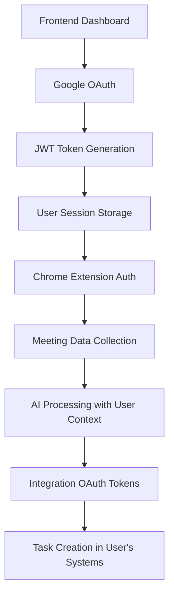

# 🔐 Comprehensive Authentication System Analysis

## Overview
This document provides a complete analysis and implementation plan for adding user authentication across the entire ScrumBot project, including Google OAuth, user onboarding, Chrome extension authentication, and integration OAuth flows.

## 🎯 Authentication Requirements

### Core User Journey
1. **User Discovery**: User visits frontend dashboard
2. **Authentication**: Google Sign-In (leveraging Chrome ecosystem)
3. **Onboarding**: Account setup, extension download, integration setup
4. **Extension Usage**: Auth-aware Chrome extension operation
5. **Integration**: User-scoped ClickUp/Notion OAuth tokens
6. **Data Isolation**: All meeting data scoped to authenticated users

## 🏗️ System Architecture

### Authentication Flow Architecture


### Component Relationships
- **Frontend Dashboard**: Primary auth gateway, user management
- **AI Processing**: JWT validation, user-scoped data operations
- **Chrome Extension**: Auth token management, user identification
- **Integration Utilities**: User-scoped OAuth token management

## 📊 Database Schema Design

### Core Authentication Tables
```sql
-- Users table (primary authentication)
CREATE TABLE users (
    id TEXT PRIMARY KEY,
    google_id TEXT UNIQUE NOT NULL,
    email TEXT UNIQUE NOT NULL,
    name TEXT NOT NULL,
    avatar_url TEXT,
    created_at TIMESTAMP DEFAULT CURRENT_TIMESTAMP,
    updated_at TIMESTAMP DEFAULT CURRENT_TIMESTAMP,
    last_login TIMESTAMP,
    is_active BOOLEAN DEFAULT TRUE
);

-- User sessions for JWT management
CREATE TABLE user_sessions (
    id TEXT PRIMARY KEY,
    user_id TEXT NOT NULL,
    jwt_token TEXT NOT NULL,
    refresh_token TEXT,
    expires_at TIMESTAMP NOT NULL,
    created_at TIMESTAMP DEFAULT CURRENT_TIMESTAMP,
    device_info TEXT,
    ip_address TEXT,
    is_active BOOLEAN DEFAULT TRUE,
    FOREIGN KEY (user_id) REFERENCES users(id)
);

-- Extension installations tracking
CREATE TABLE user_extensions (
    id TEXT PRIMARY KEY,
    user_id TEXT NOT NULL,
    extension_id TEXT,
    installation_date TIMESTAMP DEFAULT CURRENT_TIMESTAMP,
    last_used TIMESTAMP,
    version TEXT,
    is_active BOOLEAN DEFAULT TRUE,
    FOREIGN KEY (user_id) REFERENCES users(id)
);

-- Integration OAuth tokens (user-scoped)
CREATE TABLE user_integration_tokens (
    id TEXT PRIMARY KEY,
    user_id TEXT NOT NULL,
    platform TEXT NOT NULL, -- 'clickup', 'notion'
    access_token TEXT NOT NULL,
    refresh_token TEXT,
    token_type TEXT DEFAULT 'Bearer',
    expires_at TIMESTAMP,
    scope TEXT,
    workspace_id TEXT,
    created_at TIMESTAMP DEFAULT CURRENT_TIMESTAMP,
    updated_at TIMESTAMP DEFAULT CURRENT_TIMESTAMP,
    FOREIGN KEY (user_id) REFERENCES users(id),
    UNIQUE(user_id, platform)
);

-- User preferences and settings
CREATE TABLE user_preferences (
    id TEXT PRIMARY KEY,
    user_id TEXT NOT NULL,
    onboarding_completed BOOLEAN DEFAULT FALSE,
    default_integration_provider TEXT,
    task_routing_preference TEXT DEFAULT 'smart',
    extension_auto_start BOOLEAN DEFAULT TRUE,
    notification_preferences TEXT, -- JSON
    created_at TIMESTAMP DEFAULT CURRENT_TIMESTAMP,
    updated_at TIMESTAMP DEFAULT CURRENT_TIMESTAMP,
    FOREIGN KEY (user_id) REFERENCES users(id),
    UNIQUE(user_id)
);
```

### Updated Existing Tables (Add User Context)
```sql
-- Add user_id to existing tables
ALTER TABLE meetings ADD COLUMN user_id TEXT;
ALTER TABLE participants ADD COLUMN user_id TEXT;
ALTER TABLE pending_tasks ADD COLUMN user_id TEXT NOT NULL;

-- Add foreign key constraints
ALTER TABLE meetings ADD FOREIGN KEY (user_id) REFERENCES users(id);
ALTER TABLE participants ADD FOREIGN KEY (user_id) REFERENCES users(id);
```

## 🖥️ Frontend Dashboard Implementation

### 1. Google OAuth Setup
**File**: `frontend_dashboard/lib/auth.js`
```javascript
import { GoogleAuth } from 'google-auth-library';

export class AuthService {
  constructor() {
    this.client = new GoogleAuth({
      clientId: process.env.NEXT_PUBLIC_GOOGLE_CLIENT_ID,
      redirectUri: process.env.NEXT_PUBLIC_GOOGLE_REDIRECT_URI
    });
  }

  async signInWithGoogle() {
    try {
      const authUrl = this.client.generateAuthUrl({
        access_type: 'offline',
        scope: [
          'https://www.googleapis.com/auth/userinfo.profile',
          'https://www.googleapis.com/auth/userinfo.email'
        ]
      });
      
      window.location.href = authUrl;
    } catch (error) {
      console.error('Google sign-in error:', error);
      throw error;
    }
  }

  async handleCallback(code) {
    try {
      const response = await fetch('/api/auth/google/callback', {
        method: 'POST',
        headers: { 'Content-Type': 'application/json' },
        body: JSON.stringify({ code })
      });
      
      const data = await response.json();
      
      if (data.token) {
        localStorage.setItem('auth_token', data.token);
        localStorage.setItem('user', JSON.stringify(data.user));
        return data;
      }
    } catch (error) {
      console.error('Callback handling error:', error);
      throw error;
    }
  }

  getToken() {
    return localStorage.getItem('auth_token');
  }

  getUser() {
    const user = localStorage.getItem('user');
    return user ? JSON.parse(user) : null;
  }

  isAuthenticated() {
    const token = this.getToken();
    if (!token) return false;
    
    try {
      const payload = JSON.parse(atob(token.split('.')[1]));
      return payload.exp > Date.now() / 1000;
    } catch {
      return false;
    }
  }

  async signOut() {
    localStorage.removeItem('auth_token');
    localStorage.removeItem('user');
    window.location.href = '/login';
  }
}

export const authService = new AuthService();
```

### 2. Login Page
**File**: `frontend_dashboard/app/login/page.js`
```javascript
'use client';

import { useState, useEffect } from 'react';
import { authService } from '../../lib/auth';

const LoginPage = () => {
  const [loading, setLoading] = useState(false);
  const [error, setError] = useState('');

  useEffect(() => {
    // Check if already authenticated
    if (authService.isAuthenticated()) {
      window.location.href = '/';
    }

    // Handle OAuth callback
    const urlParams = new URLSearchParams(window.location.search);
    const code = urlParams.get('code');
    
    if (code) {
      handleGoogleCallback(code);
    }
  }, []);

  const handleGoogleCallback = async (code) => {
    setLoading(true);
    try {
      await authService.handleCallback(code);
      window.location.href = '/onboarding';
    } catch (error) {
      setError('Authentication failed. Please try again.');
    } finally {
      setLoading(false);
    }
  };

  const handleGoogleSignIn = async () => {
    setLoading(true);
    setError('');
    
    try {
      await authService.signInWithGoogle();
    } catch (error) {
      setError('Sign-in failed. Please try again.');
      setLoading(false);
    }
  };

  return (
    <div className="min-h-screen flex items-center justify-center bg-gray-50 py-12 px-4 sm:px-6 lg:px-8">
      <div className="max-w-md w-full space-y-8">
        <div>
          <div className="mx-auto h-12 w-12 flex items-center justify-center">
            <span className="text-3xl">🎤</span>
          </div>
          <h2 className="mt-6 text-center text-3xl font-extrabold text-gray-900">
            Sign in to ScrumBot
          </h2>
          <p className="mt-2 text-center text-sm text-gray-600">
            AI-powered meeting transcription and task creation
          </p>
        </div>
        
        <div className="mt-8 space-y-6">
          {error && (
            <div className="bg-red-50 border border-red-300 text-red-700 px-4 py-3 rounded">
              {error}
            </div>
          )}
          
          <button
            onClick={handleGoogleSignIn}
            disabled={loading}
            className="group relative w-full flex justify-center py-3 px-4 border border-transparent text-sm font-medium rounded-md text-white bg-blue-600 hover:bg-blue-700 focus:outline-none focus:ring-2 focus:ring-offset-2 focus:ring-blue-500 disabled:opacity-50"
          >
            {loading ? (
              <span>Signing in...</span>
            ) : (
              <span className="flex items-center">
                <svg className="w-5 h-5 mr-2" viewBox="0 0 24 24">
                  <path fill="currentColor" d="M22.56 12.25c0-.78-.07-1.53-.2-2.25H12v4.26h5.92c-.26 1.37-1.04 2.53-2.21 3.31v2.77h3.57c2.08-1.92 3.28-4.74 3.28-8.09z"/>
                  <path fill="currentColor" d="M12 23c2.97 0 5.46-.98 7.28-2.66l-3.57-2.77c-.98.66-2.23 1.06-3.71 1.06-2.86 0-5.29-1.93-6.16-4.53H2.18v2.84C3.99 20.53 7.7 23 12 23z"/>
                  <path fill="currentColor" d="M5.84 14.09c-.22-.66-.35-1.36-.35-2.09s.13-1.43.35-2.09V7.07H2.18C1.43 8.55 1 10.22 1 12s.43 3.45 1.18 4.93l2.85-2.22.81-.62z"/>
                  <path fill="currentColor" d="M12 5.38c1.62 0 3.06.56 4.21 1.64l3.15-3.15C17.45 2.09 14.97 1 12 1 7.7 1 3.99 3.47 2.18 7.07l3.66 2.84c.87-2.6 3.3-4.53 6.16-4.53z"/>
                </svg>
                Continue with Google
              </span>
            )}
          </button>
          
          <div className="mt-6 text-center">
            <p className="text-xs text-gray-500">
              By signing in, you agree to our Terms of Service and Privacy Policy
            </p>
          </div>
        </div>
      </div>
    </div>
  );
};

export default LoginPage;
```

### 3. Onboarding Flow
**File**: `frontend_dashboard/app/onboarding/page.js`
```javascript
'use client';

import { useState, useEffect } from 'react';
import { authService } from '../../lib/auth';

const OnboardingPage = () => {
  const [currentStep, setCurrentStep] = useState(1);
  const [user, setUser] = useState(null);
  const [extensionInstalled, setExtensionInstalled] = useState(false);
  const [integrations, setIntegrations] = useState({
    clickup: false,
    notion: false
  });

  useEffect(() => {
    const userData = authService.getUser();
    if (!userData) {
      window.location.href = '/login';
    } else {
      setUser(userData);
    }
  }, []);

  const checkExtensionInstalled = async () => {
    try {
      // Try to communicate with extension
      const response = await fetch('chrome-extension://EXTENSION_ID/ping');
      setExtensionInstalled(true);
    } catch {
      setExtensionInstalled(false);
    }
  };

  const handleExtensionDownload = () => {
    // In production, this would link to Chrome Web Store
    // For development, provide manual installation instructions
    window.open('/extension/download', '_blank');
  };

  const handleIntegrationConnect = async (platform) => {
    const authWindow = window.open(
      `/api/auth/${platform}/initiate?user_id=${user.id}`,
      'integration-auth',
      'width=600,height=700'
    );

    const checkClosed = setInterval(() => {
      if (authWindow.closed) {
        clearInterval(checkClosed);
        setIntegrations(prev => ({ ...prev, [platform]: true }));
      }
    }, 1000);
  };

  const completeOnboarding = async () => {
    try {
      await fetch('/api/user/complete-onboarding', {
        method: 'POST',
        headers: {
          'Authorization': `Bearer ${authService.getToken()}`,
          'Content-Type': 'application/json'
        }
      });
      
      window.location.href = '/';
    } catch (error) {
      console.error('Failed to complete onboarding:', error);
    }
  };

  const steps = [
    {
      title: 'Welcome to ScrumBot',
      content: (
        <div className="text-center">
          <h2 className="text-2xl font-bold mb-4">Welcome, {user?.name}! 🎉</h2>
          <p className="text-gray-600 mb-6">
            Let's set up your AI-powered meeting assistant in just a few steps.
          </p>
          <button
            onClick={() => setCurrentStep(2)}
            className="bg-blue-600 text-white px-6 py-2 rounded-lg hover:bg-blue-700"
          >
            Get Started
          </button>
        </div>
      )
    },
    {
      title: 'Install Chrome Extension',
      content: (
        <div className="text-center">
          <h2 className="text-2xl font-bold mb-4">Install Chrome Extension 🔌</h2>
          <p className="text-gray-600 mb-6">
            The Chrome extension captures meeting audio and sends it for AI processing.
          </p>
          
          {extensionInstalled ? (
            <div className="bg-green-50 border border-green-300 text-green-700 p-4 rounded-lg mb-4">
              ✅ Extension installed successfully!
            </div>
          ) : (
            <div>
              <button
                onClick={handleExtensionDownload}
                className="bg-blue-600 text-white px-6 py-2 rounded-lg hover:bg-blue-700 mb-4"
              >
                Download Extension
              </button>
              <p className="text-sm text-gray-500">
                After installation, refresh this page
              </p>
            </div>
          )}
          
          <div className="flex justify-between mt-8">
            <button
              onClick={() => setCurrentStep(1)}
              className="text-gray-500 hover:text-gray-700"
            >
              Back
            </button>
            <button
              onClick={() => setCurrentStep(3)}
              disabled={!extensionInstalled}
              className="bg-blue-600 text-white px-6 py-2 rounded-lg hover:bg-blue-700 disabled:opacity-50"
            >
              Next
            </button>
          </div>
        </div>
      )
    },
    {
      title: 'Connect Integrations',
      content: (
        <div className="text-center">
          <h2 className="text-2xl font-bold mb-4">Connect Your Tools 🔗</h2>
          <p className="text-gray-600 mb-6">
            Connect ClickUp or Notion to automatically create tasks from meeting insights.
          </p>
          
          <div className="grid grid-cols-1 md:grid-cols-2 gap-4 mb-6">
            <div className="border border-gray-200 rounded-lg p-4">
              <div className="text-2xl mb-2">📋</div>
              <h3 className="font-semibold">ClickUp</h3>
              <p className="text-sm text-gray-600 mb-3">Project management and task tracking</p>
              <button
                onClick={() => handleIntegrationConnect('clickup')}
                disabled={integrations.clickup}
                className={`w-full px-4 py-2 rounded ${
                  integrations.clickup
                    ? 'bg-green-100 text-green-700'
                    : 'bg-blue-600 text-white hover:bg-blue-700'
                }`}
              >
                {integrations.clickup ? 'Connected ✅' : 'Connect'}
              </button>
            </div>
            
            <div className="border border-gray-200 rounded-lg p-4">
              <div className="text-2xl mb-2">📝</div>
              <h3 className="font-semibold">Notion</h3>
              <p className="text-sm text-gray-600 mb-3">Documentation and knowledge base</p>
              <button
                onClick={() => handleIntegrationConnect('notion')}
                disabled={integrations.notion}
                className={`w-full px-4 py-2 rounded ${
                  integrations.notion
                    ? 'bg-green-100 text-green-700'
                    : 'bg-blue-600 text-white hover:bg-blue-700'
                }`}
              >
                {integrations.notion ? 'Connected ✅' : 'Connect'}
              </button>
            </div>
          </div>
          
          <p className="text-sm text-gray-500 mb-6">
            You can skip this step and connect integrations later
          </p>
          
          <div className="flex justify-between">
            <button
              onClick={() => setCurrentStep(2)}
              className="text-gray-500 hover:text-gray-700"
            >
              Back
            </button>
            <button
              onClick={() => setCurrentStep(4)}
              className="bg-blue-600 text-white px-6 py-2 rounded-lg hover:bg-blue-700"
            >
              Next
            </button>
          </div>
        </div>
      )
    },
    {
      title: 'Ready to Go',
      content: (
        <div className="text-center">
          <h2 className="text-2xl font-bold mb-4">You're All Set! 🚀</h2>
          <p className="text-gray-600 mb-6">
            ScrumBot is ready to help you capture and analyze your meetings.
          </p>
          
          <div className="bg-blue-50 border border-blue-200 rounded-lg p-4 mb-6">
            <h3 className="font-semibold text-blue-900 mb-2">How to use ScrumBot:</h3>
            <ol className="text-left text-blue-800 text-sm">
              <li>1. Join a meeting in Google Meet, Zoom, or Teams</li>
              <li>2. Click the ScrumBot extension icon</li>
              <li>3. Start recording to capture audio and participants</li>
              <li>4. Review transcripts and tasks in this dashboard</li>
            </ol>
          </div>
          
          <button
            onClick={completeOnboarding}
            className="bg-green-600 text-white px-8 py-3 rounded-lg hover:bg-green-700 text-lg"
          >
            Enter Dashboard
          </button>
        </div>
      )
    }
  ];

  return (
    <div className="min-h-screen bg-gray-50 py-12 px-4">
      <div className="max-w-2xl mx-auto">
        {/* Progress bar */}
        <div className="mb-8">
          <div className="flex justify-between mb-2">
            {steps.map((_, index) => (
              <div
                key={index}
                className={`w-8 h-8 rounded-full flex items-center justify-center text-sm ${
                  index + 1 <= currentStep
                    ? 'bg-blue-600 text-white'
                    : 'bg-gray-300 text-gray-600'
                }`}
              >
                {index + 1}
              </div>
            ))}
          </div>
          <div className="w-full bg-gray-200 rounded-full h-2">
            <div
              className="bg-blue-600 h-2 rounded-full transition-all duration-300"
              style={{ width: `${(currentStep / steps.length) * 100}%` }}
            ></div>
          </div>
        </div>
        
        {/* Step content */}
        <div className="bg-white rounded-lg shadow-sm border p-8">
          {steps[currentStep - 1]?.content}
        </div>
      </div>
    </div>
  );
};

export default OnboardingPage;
```

### 4. Protected Route HOC
**File**: `frontend_dashboard/components/ProtectedRoute.js`
```javascript
'use client';

import { useEffect, useState } from 'react';
import { authService } from '../lib/auth';

const ProtectedRoute = ({ children }) => {
  const [loading, setLoading] = useState(true);
  const [authenticated, setAuthenticated] = useState(false);

  useEffect(() => {
    const checkAuth = async () => {
      const isAuth = authService.isAuthenticated();
      setAuthenticated(isAuth);
      
      if (!isAuth) {
        window.location.href = '/login';
      } else {
        // Check if onboarding is completed
        try {
          const response = await fetch('/api/user/profile', {
            headers: {
              'Authorization': `Bearer ${authService.getToken()}`
            }
          });
          
          const user = await response.json();
          if (!user.onboarding_completed) {
            window.location.href = '/onboarding';
          }
        } catch (error) {
          console.error('Failed to fetch user profile:', error);
        }
      }
      
      setLoading(false);
    };

    checkAuth();
  }, []);

  if (loading) {
    return (
      <div className="min-h-screen flex items-center justify-center">
        <div className="text-center">
          <div className="animate-spin rounded-full h-12 w-12 border-b-2 border-blue-600 mx-auto mb-4"></div>
          <p>Loading...</p>
        </div>
      </div>
    );
  }

  if (!authenticated) {
    return null; // Will redirect to login
  }

  return children;
};

export default ProtectedRoute;
```

## 🔧 AI Processing Backend Implementation

### 1. Authentication Middleware
**File**: `ai_processing/app/auth_middleware.py`
```python
from fastapi import HTTPException, Depends, Security
from fastapi.security import HTTPBearer, HTTPAuthorizationCredentials
import jwt
import os
from typing import Optional
from datetime import datetime

security = HTTPBearer()

class AuthenticationError(Exception):
    pass

class AuthManager:
    def __init__(self, db):
        self.db = db
        self.secret_key = os.getenv('JWT_SECRET_KEY', 'your-secret-key')
        self.algorithm = 'HS256'
    
    def decode_token(self, token: str) -> dict:
        """Decode and validate JWT token"""
        try:
            payload = jwt.decode(token, self.secret_key, algorithms=[self.algorithm])
            
            # Check if token is expired
            if payload.get('exp', 0) < datetime.utcnow().timestamp():
                raise AuthenticationError("Token expired")
                
            return payload
        except jwt.InvalidTokenError:
            raise AuthenticationError("Invalid token")
    
    async def get_current_user(self, credentials: HTTPAuthorizationCredentials = Security(security)) -> dict:
        """Get current authenticated user"""
        try:
            payload = self.decode_token(credentials.credentials)
            user_id = payload.get('user_id')
            
            if not user_id:
                raise AuthenticationError("Invalid token payload")
            
            # Get user from database
            user = await self.db.fetch_one(
                "SELECT * FROM users WHERE id = ? AND is_active = TRUE",
                (user_id,)
            )
            
            if not user:
                raise AuthenticationError("User not found")
            
            return dict(user)
            
        except AuthenticationError as e:
            raise HTTPException(status_code=401, detail=str(e))
        except Exception as e:
            raise HTTPException(status_code=401, detail="Authentication failed")
    
    async def get_optional_user(self, credentials: Optional[HTTPAuthorizationCredentials] = Security(security, auto_error=False)) -> Optional[dict]:
        """Get current user if authenticated, None otherwise"""
        if not credentials:
            return None
        
        try:
            return await self.get_current_user(credentials)
        except HTTPException:
            return None

# Global auth manager instance
auth_manager = None

def get_auth_manager():
    global auth_manager
    if auth_manager is None:
        from app.database_interface import DatabaseFactory
        db = DatabaseFactory.create_database()
        auth_manager = AuthManager(db)
    return auth_manager

async def get_current_user(auth_mgr: AuthManager = Depends(get_auth_manager)) -> dict:
    """Dependency to get current authenticated user"""
    return await auth_mgr.get_current_user()

async def get_optional_user(auth_mgr: AuthManager = Depends(get_auth_manager)) -> Optional[dict]:
    """Dependency to get current user if authenticated"""
    return await auth_mgr.get_optional_user()
```

### 2. Google OAuth Handler
**File**: `ai_processing/app/google_auth.py`
```python
from fastapi import APIRouter, HTTPException
from google.auth.transport import requests
from google.oauth2 import id_token
import jwt
import os
from datetime import datetime, timedelta
from typing import Dict
import uuid

router = APIRouter()

class GoogleAuthHandler:
    def __init__(self, db):
        self.db = db
        self.client_id = os.getenv('GOOGLE_CLIENT_ID')
        self.client_secret = os.getenv('GOOGLE_CLIENT_SECRET')
        self.jwt_secret = os.getenv('JWT_SECRET_KEY', 'your-secret-key')
        
    async def verify_google_token(self, token: str) -> Dict:
        """Verify Google ID token and return user info"""
        try:
            idinfo = id_token.verify_oauth2_token(
                token, requests.Request(), self.client_id
            )
            
            if idinfo['iss'] not in ['accounts.google.com', 'https://accounts.google.com']:
                raise ValueError('Wrong issuer.')
            
            return {
                'google_id': idinfo['sub'],
                'email': idinfo['email'],
                'name': idinfo['name'],
                'avatar_url': idinfo.get('picture', '')
            }
        except ValueError:
            raise HTTPException(status_code=401, detail="Invalid Google token")
    
    async def create_or_update_user(self, google_user: Dict) -> Dict:
        """Create new user or update existing user"""
        existing_user = await self.db.fetch_one(
            "SELECT * FROM users WHERE google_id = ?",
            (google_user['google_id'],)
        )
        
        if existing_user:
            # Update existing user
            await self.db.execute("""
                UPDATE users SET 
                    email = ?, name = ?, avatar_url = ?, last_login = ?
                WHERE google_id = ?
            """, (
                google_user['email'],
                google_user['name'],
                google_user['avatar_url'],
                datetime.utcnow(),
                google_user['google_id']
            ))
            user_id = existing_user['id']
        else:
            # Create new user
            user_id = str(uuid.uuid4())
            await self.db.execute("""
                INSERT INTO users (id, google_id, email, name, avatar_url, last_login)
                VALUES (?, ?, ?, ?, ?, ?)
            """, (
                user_id,
                google_user['google_id'],
                google_user['email'],
                google_user['name'],
                google_user['avatar_url'],
                datetime.utcnow()
            ))
            
            # Create user preferences
            await self.db.execute("""
                INSERT INTO user_preferences (id, user_id)
                VALUES (?, ?)
            """, (str(uuid.uuid4()), user_id))
        
        # Return updated user
        user = await self.db.fetch_one("SELECT * FROM users WHERE id = ?", (user_id,))
        return dict(user)
    
    def generate_jwt_token(self, user: Dict) -> str:
        """Generate JWT token for user"""
        payload = {
            'user_id': user['id'],
            'email': user['email'],
            'name': user['name'],
            'exp': datetime.utcnow() + timedelta(days=7),
            'iat': datetime.utcnow()
        }
        
        return jwt.encode(payload, self.jwt_secret, algorithm='HS256')

@router.post("/auth/google/callback")
async def google_callback(request_data: dict):
    """Handle Google OAuth callback"""
    auth_handler = GoogleAuthHandler(db)  # Inject db dependency
    
    try:
        # Verify Google token
        google_user = await auth_handler.verify_google_token(
            request_data.get('id_token')
        )
        
        # Create or update user
        user = await auth_handler.create_or_update_user(google_user)
        
        # Generate JWT token
        token = auth_handler.generate_jwt_token(user)
        
        return {
            'token': token,
            'user': {
                'id': user['id'],
                'email': user['email'],
                'name': user['name'],
                'avatar_url': user['avatar_url'],
                'onboarding_completed': user.get('onboarding_completed', False)
            }
        }
        
    except Exception as e:
        raise HTTPException(status_code=400, detail=str(e))

@router.get("/user/profile")
async def get_user_profile(current_user: dict = Depends(get_current_user)):
    """Get current user profile"""
    # Get user preferences
    preferences = await db.fetch_one(
        "SELECT * FROM user_preferences WHERE user_id = ?",
        (current_user['id'],)
    )
    
    return {
        'id': current_user['id'],
        'email': current_user['email'],
        'name': current_user['name'],
        'avatar_url': current_user['avatar_url'],
        'onboarding_completed': preferences.get('onboarding_completed', False) if preferences else False,
        'preferences': dict(preferences) if preferences else {}
    }

@router.post("/user/complete-onboarding")
async def complete_onboarding(current_user: dict = Depends(get_current_user)):
    """Mark user onboarding as completed"""
    await db.execute("""
        UPDATE user_preferences SET 
            onboarding_completed = TRUE,
            updated_at = ?
        WHERE user_id = ?
    """, (datetime.utcnow(), current_user['id']))
    
    return {'status': 'success', 'message': 'Onboarding completed'}
```

## 🔌 Chrome Extension Authentication

### 1. Extension Manifest Updates
**File**: `chrome_extension/manifest.json`
```json
{
  "manifest_version": 3,
  "name": "ScrumBot Meeting Recorder",
  "version": "1.0",
  "description": "AI-powered meeting transcription for authenticated users",
  "permissions": [
    "activeTab",
    "scripting", 
    "tabs",
    "storage",
    "tabCapture",
    "identity"
  ],
  "host_permissions": [
    "https://meet.google.com/*",
    "https://zoom.us/*", 
    "https://teams.microsoft.com/*",
    "https://localhost:5167/*",
    "https://your-app-domain.com/*"
  ],
  "oauth2": {
    "client_id": "YOUR_GOOGLE_CLIENT_ID",
    "scopes": ["profile", "email"]
  }
}
```

### 2. Extension Authentication Service
**File**: `chrome_extension/auth/extension_auth.js`
```javascript
class ExtensionAuth {
  constructor() {
    this.apiBaseUrl = 'http://localhost:5167';
    this.authToken = null;
    this.user = null;
    this.isAuthenticated = false;
  }

  async initialize() {
    // Check for stored auth token
    const stored = await chrome.storage.local.get(['auth_token', 'user']);
    
    if (stored.auth_token) {
      this.authToken = stored.auth_token;
      this.user = stored.user;
      
      // Verify token is still valid
      const isValid = await this.verifyToken();
      if (isValid) {
        this.isAuthenticated = true;
        return true;
      } else {
        await this.clearAuth();
      }
    }
    
    return false;
  }

  async authenticateWithDashboard() {
    try {
      // Open dashboard login in new tab
      const tab = await chrome.tabs.create({
        url: `${this.apiBaseUrl}/login?extension=true`
      });
      
      // Listen for auth completion message
      return new Promise((resolve, reject) => {
        const messageListener = (message, sender) => {
          if (message.type === 'AUTH_SUCCESS' && sender.tab.id === tab.id) {
            this.authToken = message.token;
            this.user = message.user;
            this.isAuthenticated = true;
            
            // Store auth data
            chrome.storage.local.set({
              auth_token: this.authToken,
              user: this.user
            });
            
            chrome.runtime.onMessage.removeListener(messageListener);
            chrome.tabs.remove(tab.id);
            resolve(true);
          }
        };
        
        chrome.runtime.onMessage.addListener(messageListener);
        
        // Handle tab close without auth
        chrome.tabs.onRemoved.addListener((tabId) => {
          if (tabId === tab.id) {
            chrome.runtime.onMessage.removeListener(messageListener);
            reject(new Error('Authentication cancelled'));
          }
        });
      });
      
    } catch (error) {
      console.error('Extension authentication failed:', error);
      throw error;
    }
  }

  async verifyToken() {
    if (!this.authToken) return false;
    
    try {
      const response = await fetch(`${this.apiBaseUrl}/user/profile`, {
        headers: {
          'Authorization': `Bearer ${this.authToken}`
        }
      });
      
      if (response.ok) {
        const user = await response.json();
        this.user = user;
        return true;
      }
      
      return false;
    } catch (error) {
      console.error('Token verification failed:', error);
      return false;
    }
  }

  async clearAuth() {
    this.authToken = null;
    this.user = null;
    this.isAuthenticated = false;
    await chrome.storage.local.remove(['auth_token', 'user']);
  }

  getAuthHeaders() {
    if (!this.authToken) return {};
    
    return {
      'Authorization': `Bearer ${this.authToken}`
    };
  }

  getUserId() {
    return this.user?.id || null;
  }

  getUser() {
    return this.user;
  }
}

// Global instance
window.extensionAuth = new ExtensionAuth();
```

### 3. Updated Extension Background Script
**File**: `chrome_extension/worker/background.js`
```javascript
// Background script with authentication support
import ExtensionAuth from '../auth/extension_auth.js';

const auth = new ExtensionAuth();

// Initialize auth on startup
chrome.runtime.onStartup.addListener(async () => {
  await auth.initialize();
});

chrome.runtime.onInstalled.addListener(async () => {
  await auth.initialize();
});

// Handle extension icon click
chrome.action.onClicked.addListener(async (tab) => {
  if (!auth.isAuthenticated) {
    // Redirect to authentication
    await auth.authenticateWithDashboard();
  }
  
  // Proceed with normal extension functionality
  chrome.tabs.sendMessage(tab.id, {
    type: 'TOGGLE_RECORDING',
    user: auth.getUser()
  });
});

// Handle messages from content scripts
chrome.runtime.onMessage.addListener((message, sender, sendResponse) => {
  switch (message.type) {
    case 'GET_AUTH_STATUS':
      sendResponse({
        isAuthenticated: auth.isAuthenticated,
        user: auth.getUser(),
        userId: auth.getUserId()
      });
      break;
      
    case 'GET_AUTH_HEADERS':
      sendResponse(auth.getAuthHeaders());
      break;
      
    case 'REQUIRE_AUTH':
      if (!auth.isAuthenticated) {
        auth.authenticateWithDashboard().then(() => {
          sendResponse({ success: true, user: auth.getUser() });
        }).catch(error => {
          sendResponse({ success: false, error: error.message });
        });
        return true; // Async response
      } else {
        sendResponse({ success: true, user: auth.getUser() });
      }
      break;
  }
});
```

### 4. Updated WebSocket Client with Auth
**File**: `chrome_extension/services/websocketclient.js`
```javascript
class AuthenticatedWebSocketClient {
  constructor() {
    this.ws = null;
    this.isConnected = false;
    this.authToken = null;
    this.userId = null;
    this.reconnectAttempts = 0;
    this.maxReconnectAttempts = 5;
  }

  async connect() {
    // Get auth status first
    const authStatus = await this.getAuthStatus();
    
    if (!authStatus.isAuthenticated) {
      throw new Error('User not authenticated');
    }
    
    this.authToken = authStatus.authHeaders?.Authorization?.replace('Bearer ', '');
    this.userId = authStatus.userId;
    
    const wsUrl = `ws://localhost:5167/ws?token=${this.authToken}&user_id=${this.userId}`;
    
    this.ws = new WebSocket(wsUrl);
    
    this.ws.onopen = () => {
      console.log('✅ Authenticated WebSocket connected');
      this.isConnected = true;
      this.reconnectAttempts = 0;
    };
    
    this.ws.onmessage = (event) => {
      try {
        const message = JSON.parse(event.data);
        this.handleMessage(message);
      } catch (error) {
        console.error('❌ Error parsing WebSocket message:', error);
      }
    };
    
    this.ws.onclose = () => {
      console.log('🔌 WebSocket disconnected');
      this.isConnected = false;
      this.attemptReconnect();
    };
    
    this.ws.onerror = (error) => {
      console.error('❌ WebSocket error:', error);
    };
  }

  async getAuthStatus() {
    return new Promise((resolve) => {
      chrome.runtime.sendMessage({ type: 'GET_AUTH_STATUS' }, resolve);
    });
  }

  async sendEnhancedAudioChunk(audioData, participants, platform) {
    if (!this.isConnected) {
      throw new Error('WebSocket not connected');
    }
    
    const message = {
      type: 'AUDIO_CHUNK_ENHANCED',
      data: {
        audio_data: audioData,
        participants: participants,
        participant_count: participants.length,
        platform: platform,
        user_id: this.userId, // Include user context
        metadata: {
          timestamp: new Date().toISOString(),
          extension_version: chrome.runtime.getManifest().version
        }
      }
    };
    
    this.ws.send(JSON.stringify(message));
  }

  handleMessage(message) {
    switch (message.type) {
      case 'transcription_result':
        this.onTranscriptionResult(message.data);
        break;
        
      case 'MEETING_UPDATE':
        this.onMeetingUpdate(message.data);
        break;
        
      case 'auth_required':
        this.handleAuthRequired();
        break;
        
      default:
        console.log('📨 Unhandled message:', message);
    }
  }

  async handleAuthRequired() {
    console.log('🔐 Authentication required, redirecting...');
    await new Promise((resolve) => {
      chrome.runtime.sendMessage({ type: 'REQUIRE_AUTH' }, resolve);
    });
  }
}

window.authenticatedWebSocketClient = new AuthenticatedWebSocketClient();
```

## 📊 Updated Database Operations

### User-Scoped Data Access
**File**: `ai_processing/app/user_data_manager.py`
```python
class UserDataManager:
    def __init__(self, db, user_id: str):
        self.db = db
        self.user_id = user_id
    
    async def save_meeting(self, meeting_id: str, title: str) -> bool:
        """Save meeting for authenticated user"""
        return await self.db.execute("""
            INSERT INTO meetings (id, title, user_id, created_at)
            VALUES (?, ?, ?, ?)
        """, (meeting_id, title, self.user_id, datetime.utcnow()))
    
    async def get_user_meetings(self) -> List[Dict]:
        """Get all meetings for authenticated user"""
        return await self.db.fetch_all("""
            SELECT * FROM meetings WHERE user_id = ? ORDER BY created_at DESC
        """, (self.user_id,))
    
    async def save_participants_batch(self, meeting_id: str, participants: List[Dict]) -> bool:
        """Save participants for user's meeting"""
        for participant in participants:
            await self.db.execute("""
                INSERT OR REPLACE INTO participants
                (id, meeting_id, user_id, participant_id, name, platform_id, status, join_time, is_host, created_at)
                VALUES (?, ?, ?, ?, ?, ?, ?, ?, ?, ?)
            """, (
                f"participant-{uuid.uuid4()}",
                meeting_id,
                self.user_id,
                participant.get("id"),
                participant.get("name", "Unknown"),
                participant.get("platform_id", participant.get("id")),
                participant.get("status", "active"),
                participant.get("join_time", datetime.utcnow().isoformat()),
                int(participant.get("is_host", False)),
                datetime.utcnow().isoformat()
            ))
        return True
```

## 🎯 Implementation Summary

### 3-Day Implementation Plan

#### Day 1: Core Authentication
- [ ] **Database Schema**: Add user tables and foreign keys
- [ ] **Google OAuth**: Frontend and backend integration
- [ ] **JWT Management**: Token generation and validation
- [ ] **Basic Auth Middleware**: Protect API endpoints

#### Day 2: Extension Integration
- [ ] **Extension Auth**: Chrome extension authentication flow
- [ ] **WebSocket Auth**: User-scoped real-time connections
- [ ] **User Data Scoping**: All operations tied to authenticated users
- [ ] **Onboarding Flow**: Complete user setup process

#### Day 3: Integration & Polish
- [ ] **Integration OAuth**: User-scoped ClickUp/Notion tokens
- [ ] **Testing**: End-to-end authentication flow
- [ ] **Error Handling**: Comprehensive auth error management
- [ ] **Production Setup**: Environment configuration

### Key Benefits

1. **User-Centric**: All data scoped to authenticated users
2. **Seamless Flow**: Google OAuth leveraging Chrome ecosystem
3. **Extension Aware**: Chrome extension knows user context
4. **Integration Ready**: User-scoped OAuth tokens for external services
5. **Production Ready**: JWT tokens, proper session management

This comprehensive authentication system transforms ScrumBot from a demo app into a production-ready multi-user platform while maintaining the hackathon development speed.